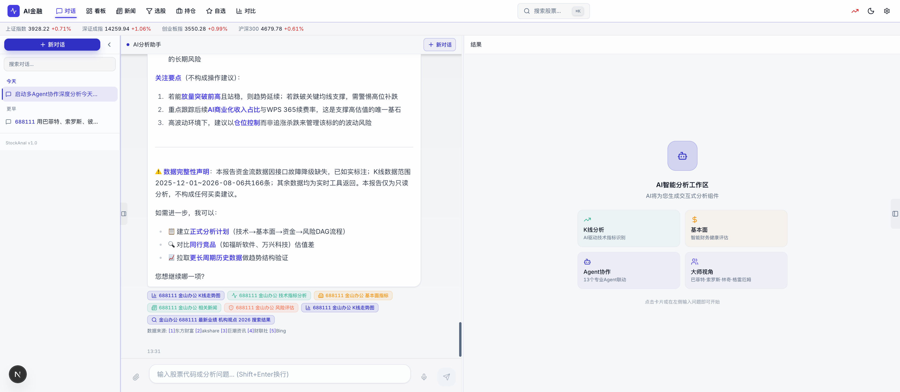
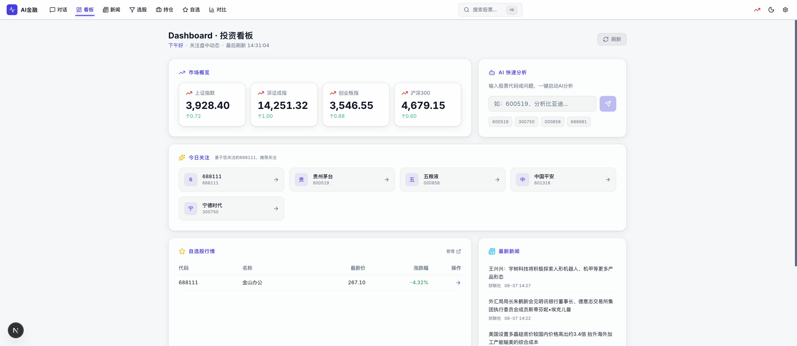

# AI-Native 智能金融分析平台

> 此项目的任何功能、架构更新，必须在结束后同步更新相关文档。这是我们契约的一部分。

[](https://github.com/LargeCupPanda/StockAnal_Sys/actions/workflows/ci.yml)
[](https://github.com/LargeCupPanda/StockAnal_Sys/actions/workflows/adapter-smoke-weekly.yml)


**基于 DeepSeek V4 + LangGraph 的 14-Agent 智能金融分析系统**，覆盖 A股/美股/ETF/指数多市场，提供 AI 对话、实时行情、技术分析、多 Agent 协同、新闻聚合、流式输出等核心能力。

---

## 📸 产品截图

### 首页 - 三栏布局 + AI 对话

*实时指数、自选股票、AI 智能对话三栏协同，Dark Glassmorphism 设计语言*

### 智能仪表盘

*市场概览、持仓组合、自选列表、快捷操作一屏展示*

---

## ✨ 核心特性

### 🤖 AI 对话与多 Agent 协作
- **DeepSeek V4 驱动**：支持 OpenAI SDK 兼容的任意 LLM 提供商
- **14 个专业 Agent**：技术分析、基本面、资金流、情绪、多空辩论、风险、决策、反思、策略演进 + 4 位投资大师人格（巴菲特/芒格/林奇/达摩达兰）
- **LangGraph 动态编排**：并行/串行/条件路由，Function Calling 自主决策
- **SSE 实时流式输出**：前端实时展示 Agent 思考过程、工具调用、进度更新

### 📊 实时行情与数据分析
- **多市场覆盖**：A股、美股、港股、ETF、指数、行业板块
- **双源冗余**：AKShare + BaoStock 主备切换，保障数据可用性
- **技术指标**：K线、MA/EMA、MACD、RSI、布林带、成交量分析
- **基本面分析**：财务三表、估值指标（PE/PB/ROE）、同行对比
- **资金流向**：个股/板块资金流、北向资金、主力动向

### 🔍 智能搜索与新闻
- **17 种搜索引擎**：百度、Google、Bing、知乎、微博等多源聚合
- **新闻聚合**：RSS 六源 + OpenCLI 爬虫（雪球/东财股吧/财联社）
- **情绪分析**：AI 自动提取新闻情绪、热点追踪

### 🎨 现代化 UI/UX
- **Dark Glassmorphism**：深色毛玻璃设计，高对比度信息密度
- **响应式布局**：移动端/桌面端自适应
- **10 种 Artifact 卡片**：K线、资金流、风险雷达、评分雷达、决策卡等可视化组件
- **对话持久化**：Zustand 本地存储，自选股/组合/主题偏好跨会话保存

---

## 📝 项目概述

本项目是基于 **Next.js 16 + Flask 3.1 + LangGraph** 的全栈 AI 金融分析平台：

- **前端**：Next.js 16.2.9 + React 19 + Tailwind 4 + shadcn/ui + TradingView Lightweight Charts
- **后端**：Flask 3.1 + Python 3.11 + LangGraph 多 Agent 编排
- **数据层**：21 Adapter + 16 业务域 Registry，覆盖 A股/美股/宏观/加密/另类数据
- **AI 引擎**：DeepSeek V4（或任意 OpenAI 兼容模型）+ 14 专业 Agent + 4 投资大师人格
- **通信协议**：SSE（Server-Sent Events）实时流 + RESTful API
- **部署**：Docker Compose 一键启动，Nginx 反向代理

---

## 🏗️ 技术架构

```
┌─────────────────────────────────────────────────────────────────┐
│                         前端层 (Port 3000)                        │
│  Next.js 16.2.9 + React 19 + Tailwind 4 + shadcn/ui             │
│  ┌──────────────┐  ┌──────────────┐  ┌──────────────┐          │
│  │  页面路由     │  │  组件库       │  │  状态管理     │          │
│  │  App Router  │  │  Artifacts   │  │  Zustand     │          │
│  │  10+ 页面    │  │  10 种卡片   │  │  6 个 Store  │          │
│  └──────────────┘  └──────────────┘  └──────────────┘          │
└─────────────────────────────────────────────────────────────────┘
                              ↓ SSE + REST API
┌─────────────────────────────────────────────────────────────────┐
│                      反向代理层 (Port 80)                         │
│                         Nginx 1.25+                              │
│  - 静态资源缓存  - GZIP 压缩  - 负载均衡  - SSL/TLS              │
└─────────────────────────────────────────────────────────────────┘
                              ↓
┌─────────────────────────────────────────────────────────────────┐
│                        后端层 (Port 8888)                         │
│              Flask 3.1 + Gunicorn + Gevent                       │
│  ┌──────────────────────────────────────────────────────────┐  │
│  │                   LangGraph Agent 系统                      │  │
│  │  ┌────────────┐  ┌────────────┐  ┌────────────┐          │  │
│  │  │ 技术分析   │  │ 基本面     │  │ 资金流      │ ...     │  │
│  │  │ 情绪分析   │  │ 多空辩论   │  │ 风险管理    │ (14个) │  │
│  │  │ 决策制定   │  │ 反思学习   │  │ 投资人格    │         │  │
│  │  └────────────┘  └────────────┘  └────────────┘          │  │
│  │           ↓ Function Calling                               │  │
│  │  ┌──────────────────────────────────────────────────────┐ │  │
│  │  │              工具层 (70+ 工具)                         │ │  │
│  │  │  数据查询 | 搜索引擎 | 新闻抓取 | 计算分析              │ │  │
│  │  └──────────────────────────────────────────────────────┘ │  │
│  └──────────────────────────────────────────────────────────┘  │
│                              ↓                                   │
│  ┌──────────────────────────────────────────────────────────┐  │
│  │              数据适配层 (21 Adapter)                        │  │
│  │  A股双源 | 美股 SEC | 港股 yfinance | 宏观 FRED/NBS        │  │
│  │  加密货币 | OpenBB | 新闻 RSS | 另类数据 (5大类)           │  │
│  └──────────────────────────────────────────────────────────┘  │
└─────────────────────────────────────────────────────────────────┘
                              ↓
┌─────────────────────────────────────────────────────────────────┐
│                        缓存层 (Port 6379)                         │
│                  Redis 7+ (可选，内存降级)                        │
│  - Agent 状态缓存  - API 响应缓存  - 会话管理                    │
└─────────────────────────────────────────────────────────────────┘
```

### 核心技术栈

| 层级 | 技术选型 | 版本 |
|------|---------|------|
| **前端框架** | Next.js + React | 16.2.9 / 19.0 |
| **UI 组件** | shadcn/ui + Tailwind CSS | 4.0 |
| **图表库** | TradingView Lightweight Charts + Recharts | - |
| **状态管理** | Zustand + Jotai | - |
| **后端框架** | Flask + Gunicorn | 3.1 |
| **AI 编排** | LangGraph + LangChain | - |
| **LLM 支持** | OpenAI SDK（支持 DeepSeek/GPT-4 等） | - |
| **数据源** | AKShare + BaoStock + Wind(万得) 三源 | - |
| **搜索引擎** | 17 种（百度/Google/Bing 等） | - |
| **爬虫引擎** | OpenCLI（15.8k⭐） | - |
| **缓存** | Redis（可选）+ 内存缓存 | 7+ |
| **数据库** | SQLite（可选）| - |
| **容器化** | Docker + Docker Compose | - |
| **Web 服务器** | Nginx | 1.25+ |

---

## 📡 API 文档

### RESTful API 端点

#### 市场数据
```http
GET /api/market_indices          # 市场指数（上证/深证/创业板/沪深300）
GET /api/stock_data              # K线数据（支持多周期）
GET /api/stock_profile           # 股票档案（PE/PB/ROE/市值）
GET /api/stock_quote_batch       # 批量报价
GET /api/sector_stocks           # 板块成分股
```

#### AI 对话与 Agent
```http
POST /api/ai/chat                # AI 对话（SSE 流式）
POST /api/ai/agent-analyze       # Agent 分析（SSE 流式）
GET  /api/agent_analysis_status  # Agent 状态查询
POST /api/cancel_analysis        # 取消分析任务
```

#### 基本面与财务
```http
POST /api/fundamental_analysis   # 基本面分析
POST /api/capital_flow           # 资金流向
POST /api/scenario_predict       # 场景预测
POST /api/risk_analysis          # 风险分析
```

#### 新闻与搜索
```http
GET /api/latest_news             # 最新新闻
GET /api/news_sentiment          # 新闻情绪
GET /api/search                  # 多引擎搜索
```

#### 系统管理
```http
GET /health                      # 健康检查
GET /api/health/deep             # 深度健康检查
GET /api/metrics                 # 系统指标
GET /api/adapters/status         # 数据源状态
```

完整 API 文档请参考：[docs/API.md](docs/API.md)

### SSE 事件流

Agent 实时进度推送：

```javascript
// 前端订阅示例
const eventSource = new EventSource('/api/agent_stream?task_id=xxx');

eventSource.addEventListener('agent.started', (e) => {
  const data = JSON.parse(e.data);
  console.log('Agent 启动:', data.agent_name);
});

eventSource.addEventListener('agent.progress', (e) => {
  const data = JSON.parse(e.data);
  console.log('进度更新:', data.progress_pct);
});

eventSource.addEventListener('agent.tool_call', (e) => {
  const data = JSON.parse(e.data);
  console.log('工具调用:', data.tool_name, data.args);
});
```

事件类型：
- `agent.started` - Agent 启动
- `agent.progress` - 进度更新
- `agent.thinking` - 思考过程
- `agent.tool_call` - 工具调用
- `agent.completed` - 分析完成
- `agent.error` - 错误信息

---

## ✨ 核心能力

### 1. 14-Agent 实时流式分析
- **LangGraph 动态编排**：基本面 + 资金流并行、多空辩论并行、条件路由（技术分析失败即快速失败）。
- **Function Calling**：Agent 通过 OpenAI tools 自主决定查询什么数据，拒绝预填硬编码。
- **AI 首席策略官**：投资者共识由 AI 综合研判论据强度（非简单投票），降级时回退硬编码评分。
- **语义记忆全覆盖**：14 个 Agent 全量接入 TF-IDF 历史分析记忆。
- **反思学习 + 策略演进**：reflection.py / strategy_evolver.py 自适应更新提示词。

### 2. SSE 实时透传
- 后端 `event_bus` 产出 Agent 事件 → `/api/agent_stream` SSE 推送 → 前端 `agent-store` 消费 → `agent-side-panel` + `tool-call-timeline` + `thinking-chain` 渲染进度、思维链、工具调用。

### 3. 17 种搜索引擎统一入口
- **中文域（8）**：百度 / 搜狗 / 360 / 必应中文 / 知乎 / 微博 / 百度百科 / Wikipedia-zh
- **全球域（9）**：Google / Bing / DuckDuckGo / Brave / Startpage / Mojeek / Yandex / Tavily / SERP
- **知识域（2）**：WolframAlpha / Wikipedia
- `multi_search()` 并发去重 + 6 条 fallback 链；LLM 可显式指定 `engine='wolframalpha' | 'wikipedia' | 'concurrent'`。

### 4. Zustand 持久化
- `chat-store` 对话历史（按 updated_at 倒序，删除即时生效）
- `watchlist-store` / `portfolio-store` 自选与组合（客户端持久化）
- `agent-store` 实时 Agent 状态
- `theme-store` / `settings-store` 主题与偏好

### 5. Dark Glassmorphism UI
- 深色毛玻璃，高通透度，CSS 变量驱动主题
- 10 种 Artifact 卡片：K 线、技术面板、资金流、风险雷达、评分雷达、基本面评分卡、决策卡、投资者人格、新闻流、搜索结果
- 对标 fiscal.ai 的信息密度与视觉品质

### 6. MCP 工具服务器
- `app/mcp/stock_data_server.py` 对外暴露标准化工具接口，支持跨系统 Agent 调用。

### 7. 数据层 v2（2026-04-15 扩张）
- **21 Adapter + 16 业务域 Registry**：A股双源冗余 + 美股SEC EDGAR + 港股/日股yfinance + 宏观(NBS/FRED/World Bank/IMF) + 加密(ccxt/CoinGecko) + 新闻RSS六源 + OpenBB桥 + **P3 另类数据 5 支柱**(航运BDI+港口+AIS / 卫星NASA CMR / 产业链OpenCorporates / 招聘Arbeitnow / ESG多源公开)。
- **`AdapterRegistry.call_with_fallback`**：domain→多 adapter 自动降级；14 Agent + 4 投资者人格全量接入。
- **10 P3 REST API 端点** + **5 P3 Artifact 组件**：后端/前端字段契约唯一化 (v2 wrap)，软降级契约 (空数据 200+success:true+空 artifact)。
- **3 OpenCLI JS 爬虫**：雪球讨论 / 东财股吧 / 财联社电报，浏览器态 Cookie 策略。
- **搜索层与数据层分工**：`search_engines`=文本/URL搜索(17引擎HTML抓取), `Registry`=结构化DataFrame(工商/财报/K线)，互补解耦。

---

## 🛠️ 技术栈

| 层 | 技术 |
|----|------|
| 前端 | Next.js 16, React 19, Tailwind 4, shadcn/ui, Zustand, Jotai, TradingView LWC, Recharts, react-markdown, AI SDK |
| 后端 | Python 3.9+, Flask 3.1, LangGraph, LangChain, OpenAI-compatible API |
| 数据源 | AKShare + BaoStock 双源冗余 + 21 Adapter/16 Domain Registry (efinance/yfinance/SEC EDGAR/NBS/FRED/WB/IMF/ccxt/CoinGecko/OpenBB/RSS×6/Ashare/easyquotation + P3 另类: Shipping/Satellite/Corporate/Jobs/ESG) |
| 爬取 | **OpenCLI (jackwener/OpenCLI, 15.8k⭐)** 浏览器态 Cookie 策略桥 + 3 JS adapter (雪球/东财股吧/财联社) |
| 搜索 | 17 引擎（8 中文 + 9 全球 + 2 知识），无需 API Key 可跑 |
| 缓存 | Redis（可选）/ 内存降级 |
| 通信 | SSE（Server-Sent Events）实时流 |
| 部署 | Docker, docker-compose, Gunicorn, Nginx |

---

## 🚀 快速启动

### 方式一：Docker Compose 一体化启动（推荐）

最快捷的启动方式，一键启动所有服务：

```bash
# 1. 克隆仓库
git clone https://github.com/LargeCupPanda/StockAnal_Sys.git
cd StockAnal_Sys

# 2. 配置环境变量
cp .env-example .env
# 编辑 .env 文件，至少填入以下必填项：
#   - OPENAI_API_URL=https://api.deepseek.com/v1
#   - OPENAI_API_KEY=your_deepseek_api_key
#   - OPENAI_API_MODEL=deepseek-chat

# 3. 启动所有服务
docker compose up -d

# 4. 查看状态和日志
docker compose ps
docker compose logs -f

# 5. 停止服务
docker compose down
```

访问 http://localhost:3000 即可使用。

服务说明：
- **backend**：Flask 后端 + LangGraph Agent 系统（端口 8888）
- **frontend**：Next.js 前端应用（端口 3000）
- **redis**：缓存服务（端口 6379）
- **nginx**：反向代理（端口 80）

### 方式二：Docker Compose 前后端分离启动

`docker-compose.frontend.yml` 用于本机或单机分离部署：后端发布 `8888`、前端发布 `3000`，最后由 Nginx 发布 `80`。前端镜像始终由已跟踪的 `frontend/Dockerfile` 构建；`NEXT_PUBLIC_API_URL` 与 `NEXT_PUBLIC_SSE_URL` 留空时不会把 Docker 内部的 `backend` DNS 暴露给浏览器。

```bash
# 1. 准备配置
cp .env-example .env
# 编辑 .env，填写 OPENAI_API_KEY、OPENAI_API_URL 和 OPENAI_API_MODEL

# 2. 依次启动基础依赖和后端、前端、Nginx
docker compose -f docker-compose.frontend.yml up -d --build redis backend
docker compose -f docker-compose.frontend.yml up -d --build frontend
docker compose -f docker-compose.frontend.yml up -d nginx

# 3. 查看状态与日志
docker compose -f docker-compose.frontend.yml ps
docker compose -f docker-compose.frontend.yml logs -f backend frontend nginx

# 4. 停止并移除本组容器
docker compose -f docker-compose.frontend.yml down
```

启动后可分别访问前端 http://localhost:3000、后端健康检查 http://localhost:8888/health，或通过 Nginx 访问 http://localhost 。如果浏览器通过其他域名或 IP 访问且需绕过 Nginx，可在启动前把 `NEXT_PUBLIC_API_URL` 与 `NEXT_PUBLIC_SSE_URL` 设置为浏览器可解析的公开后端地址。

`docker-compose.prod.yml` 用于生产部署：它启用生产 Nginx、持久化 Redis、健康检查与资源限制，并要求先准备 `.env` 和 `nginx/ssl/` 证书。启动顺序与服务名相同：

```bash
docker compose -f docker-compose.prod.yml up -d --build redis backend
docker compose -f docker-compose.prod.yml up -d --build frontend
docker compose -f docker-compose.prod.yml up -d nginx
docker compose -f docker-compose.prod.yml ps
docker compose -f docker-compose.prod.yml logs -f backend frontend nginx
docker compose -f docker-compose.prod.yml down
```

### 方式三：本地开发

适合开发调试，分别启动前后端：

#### 后端启动（Flask，端口 8888）

```bash
# 1. 安装 Python 依赖
pip install -r requirements.txt

# 2. 配置环境变量
cp .env-example .env
# 编辑 .env 填入必填项

# 3. 启动后端
python3 run.py

# 或使用启动脚本
bash scripts/start.sh start
```

#### 前端启动（Next.js，端口 3000）

```bash
# 1. 进入前端目录
cd frontend

# 2. 安装依赖
npm install

# 3. 启动开发服务器
npm run dev

# 生产构建
npm run build
npm start
```

### 环境变量配置

核心配置项（参考 `.env-example`）：

```bash
# ===== 必填项 =====
# API 提供商配置（支持任意 OpenAI SDK 兼容的 LLM）
API_PROVIDER=openai
OPENAI_API_URL=https://api.deepseek.com/v1  # DeepSeek/OpenAI/其他兼容端点
OPENAI_API_KEY=your_api_key                  # 必填
OPENAI_API_MODEL=deepseek-chat               # 主模型
NEWS_MODEL=deepseek-chat                     # 新闻模型
FUNCTION_CALL_MODEL=deepseek-chat            # Function Calling 模型

# ===== 可选增强 =====
# 搜索引擎增强（免费申请，1000次/月）
SERP_API_KEY=your_serp_api_key              # https://serper.dev/api-key
TAVILY_API_KEY=your_tavily_api_key          # https://app.tavily.com/

# 数据源 Key（免费申请，未配置时软降级）
FRED_API_KEY=your_fred_api_key              # 宏观数据 https://fred.stlouisfed.org/
FINNHUB_API_KEY=your_finnhub_api_key        # Finnhub https://finnhub.io/
OPENCORPORATES_API_KEY=your_key             # 企业工商（500次/月）
AISHUB_USERNAME=your_username               # 船舶 AIS 数据

# SEC EDGAR 必需配置（Fair Access Policy）
SEC_EDGAR_UA=StockAnalSys research@example.com  # 必填，格式：AppName Email

# ===== Agent 系统 =====
USE_AGENT_SYSTEM=true                       # 启用新 LangGraph 多 Agent 系统

# ===== 缓存配置 =====
USE_REDIS_CACHE=false                       # Redis 缓存（可选）
REDIS_URL=redis://localhost:6379            # 本地开发
# REDIS_URL=redis://redis:6379              # Docker 环境

# ===== 数据库配置 =====
USE_DATABASE=false                          # SQLite 数据库（可选）
DATABASE_URL=sqlite:///data/stock_analyzer.db

# ===== HTTP 代理（境外数据源需要）=====
# HTTP_PROXY=http://127.0.0.1:7890
# HTTPS_PROXY=http://127.0.0.1:7890
# NO_PROXY=localhost,127.0.0.1,akshare.com,baostock.com

# ===== Wind(万得) MCP 数据源（可选，需付费订阅）=====
WIND_API_KEY=                               # Wind API 密钥
WIND_DATABASE_URL=sqlite:///data/wind_cache.db
WIND_QUOTA_S=50                             # S档日配额
WIND_QUOTA_A=30                             # A档日配额
WIND_QUOTA_B=20                             # B档日配额
WIND_CALL_TIMEOUT=120                       # API 调用超时（秒）

# ===== 超时配置 =====
AI_HTTP_TIMEOUT=600                         # LLM HTTP 超时（秒）
AI_CHAT_TIMEOUT=1800                        # 单轮对话超时（秒）
AGENT_GRAPH_TIMEOUT=1800                    # Agent 图超时（秒）
NEXT_PUBLIC_API_DEFAULT_TIMEOUT_MS=180000   # 前端 API 超时（毫秒）
NEXT_PUBLIC_SSE_HEARTBEAT_TIMEOUT_MS=360000 # SSE 心跳超时（毫秒）
```

完整配置说明请参考 [`.env-example`](.env-example) 文件。

---

完整 API 文档请访问：http://localhost/api-docs（服务启动后）

---

## 📋 版本

### v3.1.0（2026-04-15，数据层 v2）

**核心特性**：
- 21 Adapter + 16 Domain Registry + `call_with_fallback` 自动降级
- 14 Agent + LangGraph 动态编排 + Function Calling
- SSE 实时透传 + Zustand 持久化 + 10 种 Artifact 卡片
- 17 搜索引擎统一入口 + 另类数据 5 支柱
- Dark Glassmorphism UI，高信息密度设计

---

## ⚠️ 免责声明

本项目为 AI 驱动探索版，输出**不构成投资建议**。AI 可能产生错误内容，由此造成的任何损失本项目不负责。

---

## 📁 项目结构

```
StockAnal_Sys/
├── frontend/                        # Next.js 16.2.9 前端
│   ├── src/
│   │   ├── app/                     # App Router 页面路由
│   │   │   ├── page.tsx             # 首页（三栏布局）
│   │   │   ├── dashboard/           # 智能仪表盘
│   │   │   ├── stock/[code]/        # 股票详情页
│   │   │   ├── news/                # 新闻聚合
│   │   │   ├── portfolio/           # 投资组合
│   │   │   ├── watchlist/           # 自选列表
│   │   │   ├── compare/             # 多股对比
│   │   │   └── screener/            # 市场扫描
│   │   ├── components/
│   │   │   ├── agent/               # Agent 组件（进度/工具调用/思维链）
│   │   │   ├── artifacts/           # 10 种可视化卡片
│   │   │   ├── charts/              # 图表封装
│   │   │   ├── chat/                # AI 对话组件
│   │   │   └── market/              # 行情组件
│   │   └── lib/
│   │       ├── api/                 # API 客户端
│   │       ├── stores/              # Zustand 状态管理
│   │       ├── hooks/               # React Hooks
│   │       └── utils/               # 工具函数
│   ├── public/                      # 静态资源
│   └── package.json
│
├── app/                             # Flask 后端
│   ├── web/
│   │   ├── web_server.py            # 主路由（163 条路由）
│   │   ├── openapi_spec.py          # OpenAPI 3.0 规范
│   │   └── schema.py                # marshmallow 校验
│   ├── agents/
│   │   ├── coordinator.py           # LangGraph 协调器
│   │   ├── technical_analyst.py     # 技术分析 Agent
│   │   ├── fundamental_analyst.py   # 基本面分析 Agent
│   │   ├── sentiment_analyst.py     # 情绪分析 Agent
│   │   ├── bull_researcher.py       # 多方研究员
│   │   ├── bear_researcher.py       # 空方研究员
│   │   ├── risk_manager.py          # 风险管理 Agent
│   │   ├── decision_maker.py        # 决策 Agent
│   │   └── investors/               # 投资大师人格（4位）
│   ├── core/
│   │   ├── ai_client.py             # AI 客户端封装
│   │   ├── tools.py                 # 70+ 工具函数
│   │   ├── data_provider.py         # 数据提供层
│   │   ├── search.py                # 17 引擎聚合搜索
│   │   ├── event_bus.py             # Agent 事件总线
│   │   └── cache.py                 # 缓存管理
│   ├── adapters/
│   │   ├── adapter_registry.py      # 适配器注册表
│   │   ├── akshare_adapter.py       # AKShare 适配器
│   │   ├── baostock_adapter.py      # BaoStock 适配器
│   │   ├── sec_edgar_adapter.py     # SEC EDGAR 适配器
│   │   ├── fred_adapter.py          # FRED 宏观数据
│   │   └── ...                      # 其他 17 个适配器
│   └── analysis/
│       ├── stock_analyzer.py        # 股票分析引擎
│       ├── fundamental_analyzer.py  # 基本面分析
│       ├── capital_flow_analyzer.py # 资金流分析
│       └── news_fetcher.py          # 新闻抓取
│
├── docs/                            # 项目文档
│   ├── screenshots/                 # 产品截图
│   ├── API.md                       # API 文档
│   ├── FRONTEND_ARCHITECTURE.md     # 前端架构
│   ├── BACKEND_GAPS.md              # 后端技术债
│   └── design/                      # 设计文档
│
├── tests/                           # 测试套件
│   ├── backend/
│   │   ├── api/                     # API 集成测试（184 个）
│   │   ├── unit/                    # 单元测试（453 个）
│   │   └── integration/             # 集成测试（146 个）
│   └── frontend/
│       └── __tests__/               # 前端测试（42 个）
│
├── scripts/                         # 部署脚本
│   ├── start.sh                     # 启动脚本
│   └── deploy.sh                    # 部署脚本
│
├── nginx/                           # Nginx 配置
│   ├── default.conf                 # 开发环境配置
│   └── prod.conf                    # 生产环境配置
│
├── data/                            # 运行时数据目录
│   ├── stock_names.json             # A股名称快照（5528条）
│   └── *.db                         # SQLite 数据库
│
├── docker-compose.yml               # Docker Compose 配置
├── Dockerfile                       # 后端 Dockerfile
├── requirements.txt                 # Python 依赖
├── .env-example                     # 环境变量示例
└── README.md                        # 本文档
```

---

## 🧪 测试与质量

### 测试覆盖

```bash
# 后端测试（pytest）
pytest tests/backend/                    # 全量测试（783 个用例）
pytest tests/backend/api/                # API 测试（184 个）
pytest tests/backend/unit/               # 单元测试（453 个）
pytest tests/backend/integration/        # 集成测试（146 个）

# 前端测试（vitest）
cd frontend
npm run test                             # 单元测试（42 个用例）
npm run test:coverage                    # 覆盖率报告

# E2E 测试（Playwright）
npx playwright test                      # 端到端测试
```

### CI/CD

GitHub Actions 自动化流程：
- **CI 流水线**：代码提交自动触发 lint + test + build
- **Adapter 健康检查**：每周自动检查 21 个数据源可用性
- **依赖安全扫描**：npm audit + pip-audit

---

## 🤝 贡献指南

欢迎贡献代码、报告 Bug、提交功能建议！

### 开发流程

1. Fork 本仓库
2. 创建特性分支：`git checkout -b feature/your-feature`
3. 提交代码：`git commit -m 'feat: add some feature'`
4. 推送分支：`git push origin feature/your-feature`
5. 提交 Pull Request

### 提交规范

遵循 [Conventional Commits](https://www.conventionalcommits.org/)：

- `feat`: 新功能
- `fix`: Bug 修复
- `docs`: 文档更新
- `style`: 代码格式（不影响代码运行）
- `refactor`: 重构
- `test`: 测试用例
- `chore`: 构建过程或辅助工具变动

### 代码风格

- **Python**: Black + Flake8 + isort
- **TypeScript/React**: ESLint + Prettier
- **提交前运行**: `pre-commit run --all-files`

---

## 🙏 致谢

本项目站在巨人的肩膀上：

### 核心依赖
- [Next.js](https://nextjs.org/) - React 全栈框架
- [Flask](https://flask.palletsprojects.com/) - Python Web 微框架
- [LangGraph](https://github.com/langchain-ai/langgraph) - AI Agent 编排框架
- [LangChain](https://github.com/langchain-ai/langchain) - LLM 应用开发框架
- [AKShare](https://github.com/akfamily/akshare) - 金融数据获取
- [BaoStock](http://baostock.com/) - 证券数据接口

### 数据源
- [SEC EDGAR](https://www.sec.gov/edgar) - 美股财务数据
- [FRED](https://fred.stlouisfed.org/) - 宏观经济数据
- [yfinance](https://github.com/ranaroussi/yfinance) - Yahoo Finance API
- [OpenBB](https://openbb.co/) - 开源金融终端

### UI/UX
- [shadcn/ui](https://ui.shadcn.com/) - React 组件库
- [TradingView Lightweight Charts](https://tradingview.com/) - 图表库
- [Tailwind CSS](https://tailwindcss.com/) - CSS 框架

### 灵感来源
- [fiscal.ai](https://fiscal.ai) - 产品质感与信息密度

---

## 📧 联系方式

- **Issues**: [GitHub Issues](https://github.com/LargeCupPanda/StockAnal_Sys/issues)
- **Discussions**: [GitHub Discussions](https://github.com/LargeCupPanda/StockAnal_Sys/discussions)

---

<div align="center">

**如果这个项目对你有帮助，请给个 ⭐️ Star！**

Made with ❤️ by [LargeCupPanda](https://github.com/LargeCupPanda)

</div>

---

> **此项目的任何功能、架构更新，必须在结束后同步更新相关文档。这是我们契约的一部分。**
