# TODO

## Skill 吸收与处置（2026-08-05）

**状态**：✅ **已完成删除与降级补强**

| 项 | 状态 | 说明 |
|---|---|---|
| 删除 `skill参考/akshare-finance/` | ✅ | 100% 吸收到 adapters，skill 已删除 |
| 保留 `skill参考/tencent-news/` | 🔵 | 作为备用参考 |
| P1: NBS 宏观数据降级 | ✅ | `nbs_adapter.py` + AkShare (CPI/GDP/PMI/工业增加值) |
| P2: CoinGecko 加密货币降级 | ✅ | `coingecko_adapter.py` + AkShare crypto_js_spot (实时价格) |
| 测试覆盖 | ✅ | `test_adapters_nbs.py` (6 passed) + `test_adapters_coingecko.py` (7 passed) |

---

## UI改造A-D（S-UI-0~3 代码已落地 · S-UI-charts 已提交 · S-UI-4 部分完成 · live/live2 连调已截图）

> **状态**：**S-UI-0~3 + S-UI-charts 代码已提交** · Comdr **已通过 2026-07-24 全量 A–D** · **S-UI-4 curl+CDP 五路由 + 主题已做 · swagger 代理已修（`8cdfe24`）** · **[S-UI-live2] DP-P0 后全栈真重启 + CDP 截图 `/tmp/stockanal_ui/live2_*.png`** · **仍禁 push**  
> **计划文档**：`/Users/panda/Downloads/StockAnal_Sys/docs/design/ui-renovation-plan.md`（`v1.6-sui4-final-snapshot`）  
> **产品主语**：Agent 决策工位 + 可信数据（非皮肤堆砌）  
> **硬约束**：铁律 #1 零假值 · #2 禁用 Playwright · #3 资源红线；只改原件

### [S-UI-live2] post DP-P0 全栈 CDP smoke（2026-07-25 06:23~06:28 +08）

| 项 | 结果 |
|---|---|
| 可交付 | HEAD 含 `bbac8ee` DP-P0-1 · `7f70b9f` DP-P0-2 |
| 服务 | BE PID **11292** `:8888` · FE **11324** node `:3000` · **测后保持运行** |
| 截图 | `/tmp/stockanal_ui/live2_{home,home_15s,dashboard,stock_600519,portfolio,settings,api_docs}.png` |
| 指数 | `source=cache` / `meta.data_quality=cached_fresh` / `X-Data-Source: cache` · 上证 **3814.20 -1.61%** 等真数（非 disk_last_good、非 503） |
| 个股 | 600519 名 **贵州茅台** · 价 **1297.41** · K 线 242 行 `meta.source=akshare` |
| api-docs | Swagger UI 加载 · `/static/swagger.json` **200** |
| Agent | `POST /api/ai/chat` SSE **200** ~7.6KB/12s 至 `done`；未另存 `live2_agent.png` |

### [S-UI-live] 全栈 CDP smoke（2026-07-24 23:50~24:05 +08 锚点段）

| 项 | 结果 |
|---|---|
| 可交付 | HEAD 含 `8ba801a` charts · `8cdfe24` swagger 代理 · `51907ba` S-UI-4 final snapshot |
| 服务 | BE PID **98795** `:8888` · FE **98826** next-server `:3000` · **测后保持运行** |
| 截图 | `/tmp/stockanal_ui/live_{home,home_15s,dashboard,stock_600519,portfolio,settings,api_docs}.png` |
| 指数 | 初 curl cache HIT 真数 → 后 **503 DEGRADED**；UI `---` /「暂无指数数据」（无假数） |
| api-docs | 浏览器 title「股票智能分析系统 API文档」· base `/static/swagger.json` |
| Agent | SSE 已开流，25s 客户端截断；未存 `live_agent_stream.png` |

### 门禁链（按序）

```
S-UI-0 Token冻结+截图基线 ──► S-UI-1 A系统 ──► S-UI-2 B+C ──► S-UI-3 D皮肤 ──► S-UI-charts ──► S-UI-4 回归
```

| ID | 阶段 | 范围摘要 | 状态 | 依赖 |
|----|------|----------|------|------|
| S-UI-0 | Token 冻结 + 截图基线 | plan §5 写入 `globals.css`；语义 token 单源 | **代码已落地** | Comdr 通过 ✅ |
| S-UI-1 | **A** 设计系统 | Token + navbar/badge/button 高频表面统一 | **代码已落地** | S-UI-0 |
| S-UI-2 | **B+C** 首页三态 + Agent 工位 | page 三态；agent 侧栏/进度/HITL/Plan | **代码已落地** | S-UI-1 |
| S-UI-3 | **D** 视觉皮肤 + 空/错态 | alert warn/degraded；settings 空错统一 | **代码已落地** | S-UI-2 |
| S-UI-charts | charts/artifacts 涨跌色绑 token | `css-var` + stockPalette；去硬编码红绿 | **代码已落地** `8ba801a` | S-UI-3 |
| S-UI-4 | 回归 | curl 启服 + CDP 矩阵 + 无假数 + 文档闭环 | **curl+CDP 五路由 + 主题已做 · api-docs swagger.json 已代理 200 · sticky 未强测 · Agent 真 SSE 跳过** | S-UI-charts |

### 阶段验收勾选

- [x] **S-UI-0**：Token 表写入 `globals.css`（含 `--up`/`--down`/`--fs-md`/`--bg-surface` 等）；审批栏已勾通过 ✅
- [x] **S-UI-1 A（代码）**：navbar/badge/button 走 token；表面 polish 已提交
- [x] **S-UI-2 B+C（代码）**：首页 IA + Agent 工位（side-panel/progress/plan/approvals）已提交
- [x] **S-UI-3 D（代码）**：`alert` warn/degraded + settings 空/错态 + ui-empty/ui-dash
- [x] **S-UI-charts（2026-07-24）**：charts/artifacts 涨跌与语义色绑 `--stock-up/down` / `--ok/warn/danger`；`tsc --noEmit` 0；commit `8ba801a`
- [x] **S-UI-4（curl + 启服 2026-07-24）**：后端 `/health` 200；前端冷启后 `/health`/`/`/`/dashboard`/`/stock/600519`/`/portfolio`/`/settings` 200；`market_indices` 503 DEGRADED（无假指数，铁律 #1）
- [x] **S-UI-4 浏览器路由矩阵（CDP 2026-07-24 23:00~23:13 +08:00）**：Chrome `:9222` tab 可用；依次打开 `/`/`/dashboard`/`/stock/600519`/`/portfolio`/`/settings`；截图 `/tmp/stockanal_ui/sui4_*.png`；五页 DOM 均无 Hydration 红字、无已知假值 `1174.06`/`4384.17`
- [x] **S-UI-4 假数多窗（首页）**：5s + 15s 两帧指数均为 `---`；同期 `curl :8888/api/market_indices` 持续 **503 DEGRADED**（无假价对照通过）
- [x] **S-UI-4 残余 · 主题切换（2026-07-24 23:18~23:30 +08）**：navbar `aria-label=切换主题` 亮↔暗；bg `rgb(247,248,250)` ↔ `rgb(10,10,26)`；切换采样 `flashWhite=false`；截图 `/tmp/stockanal_ui/sui4_theme_before_light.png` · `sui4_theme_after_dark.png` · `sui4_theme_light.png`
- [x] **S-UI-4 残余 · `/api-docs`**：BE `/api-docs` **302**→`/api/docs/` **200**；FE 经 `:3000` 同源可加载定义——`next.config.ts` 开发 rewrite `/static/:path*`→`:8888` 后 `GET :3000/static/swagger.json` **200**（14483B，此前 404）；`/api-docs` shell 200；未强测浏览器 UI 交互
- [ ] **S-UI-4 残余 · sticky 强滚**：首页 main `canScroll=false`（内容未溢出）→ **无法强测**；DOM 已有 `sticky top-0 z-20`
- [ ] **S-UI-4 残余 · Agent/HITL 真 SSE**：本轮进程 `MOCK_LLM=1`（`/api/health/deep` llm skipped）→ **诚实跳过**；未重启 `MOCK_LLM=0`（避资源/积分硬撑）
- [ ] plan §8.1 产品/视觉全勾 · **未完成**（仍欠 sticky 强测 + Agent/HITL/provenance/scorecard + 涨跌色有数对照）
- [ ] **仍禁 push**（除非 Comdr 另行授权）

### S-UI-0~3 + charts 落地文件

| Sprint | 文件 |
|--------|------|
| S-UI-0/1 | `frontend/src/app/globals.css` · `layout/navbar.tsx` · `ui/badge.tsx` · `ui/button.tsx` |
| S-UI-2 | `app/page.tsx` · `agent/agent-side-panel.tsx` · `agent-progress-panel.tsx` · `pending-approvals.tsx` · `plan-list-panel.tsx` |
| S-UI-3 | `ui/alert.tsx` · `app/settings/page.tsx` |
| S-UI-charts | `lib/utils/css-var.ts` · `charts/base-*.tsx` · `artifacts/*`（涨跌/置信/情感） |
| 文档 | `docs/design/ui-renovation-plan.md` · 本节 TODO |

### S-UI-4 浏览器矩阵证据（2026-07-24 23:00~23:13 +08:00，CDP）

| 项 | 结果 |
|---|---|
| 时间锚点 | 本机 2026-07-24 08:00:38 -0700；Cloudflare/GitHub Date `Fri, 24 Jul 2026 15:00:3x GMT`（=23:00 +08）；偏差 ≪100s |
| 内存闸门 | 启服前 free pages ~74142；中段最低 ~4335（已有服务继续，未另开重负载）；收尾停服后 ~96746 |
| 服务 | 后端 `AUTH_REQUIRED=false` PID 96069 `:8888`；前端 Next `:3000`；**验收后已 kill，端口空** |
| `market_indices` | BE/FE 均为 **503 DEGRADED** / `stale_cache`，body 无 indices 数值 |
| `/` 5s+15s | 上证/深证/创业板/沪深300 显示 `---`；`priceLike=[]`；无 Hydration |
| `/dashboard` | 「暂无指数数据 / 上游降级或暂无快照」；`priceLike=[]`；无假价 |
| `/stock/600519` | 名称「贵州茅台」+ code；K 线「加载K线数据中…」（无假 K 值） |
| `/portfolio` | 总市值/盈亏/收益率 `—`；暂无持仓；main 可滚 |
| `/settings` | 主题/深度/Wind 配额 UI 可达；main 可滚；无假行情 |
| 截图 | `/tmp/stockanal_ui/sui4_home_5s.png` · `sui4_home_15s.png` · `sui4_dashboard.png` · `sui4_stock_600519.png` · `sui4_portfolio.png` · `sui4_settings.png` |
| 未做（v1.4 时） | 主题亮暗切换截图；sticky 强制滚动；Agent 真 SSE 路径；`/api-docs` 浏览器 |

### S-UI-4 残余验收证据（2026-07-24 23:18~23:32 +08:00，CDP + curl）

| 项 | 结果 |
|---|---|
| 时间锚点 | 本机 2026-07-24 08:19:26 -0700；Cloudflare `Fri, 24 Jul 2026 15:19:30 GMT`；GitHub `15:19:25 GMT`（=23:19 +08）；偏差 ≪100s |
| 内存 | 启服中 free pages 一度 ~4100（红线附近）；主体 ≥8k 后继续轻负载 CDP；未另开重负载 |
| 服务 | `AUTH_REQUIRED=false DISABLE_NETWORK=1 MOCK_LLM=1` 后端 PID 96858 `:8888`；前端 Next 96896 `:3000`；**验收后须 kill** |
| 主题切换 | light→dark→light→dark 可逆；`theme-storage` 同步；`flashWhite=false`；FOUC 内联守卫存在（reload 后 class=storage） |
| sticky | 指数栏 DOM sticky 存在；首页 `main.canScroll=false` → **内容未溢出无法强测 sticky** |
| `/api-docs` curl | BE `302 Location:/api/docs/`；BE `/api/docs/` 200 title=股票智能分析系统 API文档；FE `/api-docs` 200 同 title |
| `/api-docs` 浏览器（v1.5 当时） | BE Swagger UI `opCount=17`；FE shell 当时报 `Fetch error Not Found /static/swagger.json`（rewrite 缺口） |
| `/api-docs` 定义代理（`8cdfe24` 后） | 开发 rewrite `/static/:path*`→`:8888`；curl `:3000/static/swagger.json` **200**（14483B）；**已修 404**；浏览器 Swagger 点选交互仍未强测 |
| `market_indices`（本轮） | cache HIT；上证 3814.1978 / 深证 13774.676 / 创业板 3480.87 / 沪深300 4649.1917（真 API，非 UI 假数） |
| Agent 真路径 | **跳过**：`MOCK_LLM=1` 启动；deep health `llm.skipped=true reason=MOCK_LLM=1`；mock `/api/ai/chat` 仍返回 SSE meta（非真 LLM 路径） |
| 截图新增 | `sui4_theme_before_light.png` · `sui4_theme_after_dark.png` · `sui4_theme_light.png` · `sui4_api_docs_fe.png` · `sui4_api_docs_be.png` |

### S-UI-4 curl/启服证据（2026-07-24，本地）

| 检查 | 结果 |
|------|------|
| 后端 `GET :8888/health` | **200** `status=ok` version=3.1.0；首轮 `uptime_s≈17` |
| 前端 `GET :3000/health` | 冷启首轮超时；热身后 **200** 透传后端 |
| `GET :3000/` `/dashboard` `/stock/600519` `/portfolio` `/settings` | **均为 200** |
| `GET :8888/api/market_indices` | **503** DEGRADED `stale_cache`（本机上游不可用，**未伪造指数**） |
| `tsc --noEmit` | **exit 0** |
| Playwright | **未使用** |
| 浏览器截图/DOM 采样 | **已完成五路由 + 首页双窗**（见上节）；残余产品项见 `[ ]` |
| 服务 | 验收后已 stop 8888/3000 |

**遗留（阻塞 §8 产品全勾）**
- sticky 在可滚内容下的吸顶强测（内容未溢出 → 本轮无法强测）
- Agent/HITL/provenance/scorecard 真 SSE（需 `MOCK_LLM=0` + 可用 LLM）
- FE `/api-docs` 浏览器内 Swagger 交互点选（curl 定义 **200 已修** `8cdfe24`，交互未强测）
- 涨跌色全站有数帧对照
- **仍禁 push**

### 明确不做（防范围漂移）

- [x] 不换 Next / 不上 Vite / 不推倒 dojo 能力
- [x] 不重写后端 API / OpenAPI / schema；不扩 agent 协议（属 dojo-agents-absorption-plan）
- [x] 不引入新 UI 框架全家桶；不替换 Recharts 核心

### 下一步

- [x] 审批 `docs/design/ui-renovation-plan.md` §1（**已通过 2026-07-24 Comdr 全量 A–D**）
- [x] **S-UI-0~3 代码**逻辑提交落盘
- [x] **S-UI-charts** 绑 token 提交 `8ba801a`
- [x] **S-UI-4 curl/启服预检**落盘
- [x] **S-UI-4 CDP 五路由矩阵 + 假数双窗**落盘
- [x] **S-UI-4 残余 · 主题切换**落盘
- [x] **S-UI-4 残余 · api-docs curl + swagger 代理修复**（`8cdfe24`，`:3000/static/swagger.json` 200）
- [ ] **S-UI-4 仍未勾**：sticky 强滚 / Agent·HITL 真 SSE / api-docs 浏览器交互 / 涨跌色有数帧 / §8.1 产品全勾
- [ ] 跟踪单源：勾选只改本节；实现 commit 必须引用 plan 章节与 sprint 编号
- [ ] **仍禁 push**

---

## 2026-07-23 — 方案复审·文档对齐（Top1）

- [x] 检索 CLAUDE.md / docs/design 中 Skills/Plan/Memory/压缩/Checkpoint/provenance 过时句
- [x] 与代码对齐：Plan=状态机 / Skills=system_hint / Memory 启动预取常开 / compress 未做 / Checkpoint 回放未做 / provenance 已强制
- [x] DELIVERY-STATUS v1.12 + 设计文档 §11.0b 能力真相表
- [x] CLAUDE.md 追加「方案复审·文档对齐」
- [ ] **仍禁 push**
- [ ] **仍故意未做（代码）**：Plan 真 step / Skills 运行时 / context_compress / Checkpoint HTTP+前端回放 / 真券商

## 2026-07-20 14:58:40 +08:00 — 彻底停服后 CDP Bridge 真测

- [x] 彻底停 8888/3000 → 干净重启 → cdp-bridge streamable-http :8765/:18765
- [x] CDP 真测通过：
  - Settings：Wind 开关可点、配额 S50/A30/B20 UI、`X-Use-Wind:true`
  - Dashboard：上证 3796.28 等真实指数 + 贵州茅台关注
  - Stock 600519：贵州茅台 ¥1253.00 -0.48% + K线/基本面 tab
  - API：stock_name 贵州茅台 / wind/quota success / health ok
- [x] 后端单测 **54 passed**
- [x] 截图：`/tmp/stockanal_review/cdp/*verified*.png`
- [x] 测后彻底停服（8888/3000/cdp-bridge）
- [ ] **仍禁 push**

## 2026-07-20 14:44:15 +08:00 — 裁决执行：use_wind 接线 + 联动真测

- [x] `X-Use-Wind` + ContextVar + `_call_wind` 闸门；默认 opt-in false
- [x] 前端 `apiClient`/`streamPost` 注入 header；Settings 配额 `extractData`
- [x] `/api/wind/quota` 收回 PUBLIC_PATHS（AUTH 下 401）
- [x] 本地启 8888/3000；CDP 真测闭环（见上节）
- [x] wind 单测 **54 passed**；tsc 0
- [x] commits：`7cae626` use_wind / `01eb747` docs
- [ ] **仍禁 push**

## 2026-07-20 14:30:16 +08:00 — 功能性审查（后端→前端→联动）

- [x] 后端 Phase1 + 名称缓存回归修复 `bc19fa3`
- [x] 前端 Phase2 tsc 0
- [x] 联动缺口已闭环（use_wind 接线）

## 2026-07-20 14:04:02 +08:00 — 进度同步（git 审查）

- HEAD 现为 `bc19fa3`；**main ahead origin +456**，未 push
- [x] Bug Hunt Round 2：**19/19 = 100%**
- [x] Wind 扩展 WIP 已本地 commit 冻结（`bc19fa3`）
- [x] SSE `market_stream` OpenAPI 已文档化（`3409580`）
- [ ] A2A 协议端点文档化（评估中）
- [ ] Kimi 续测：`/compare` `/portfolio` 市场扫描 `api-docs`；agent UI；联网 profile/stock_data

## 2026-06-15 13:48:26 +08:00 — 4 议题审查裁决 + OpenAPI 第三~六批文档化 + deps 维护

- [x] 4 议题审查裁决：A2A RPC 撤销（不立项）、前端 useState/use client 关闭（不改）、OpenAPI 立项、npm lockfile 修复。
- [x] OpenAPI 第三批文档化（`73bfc36`，+8）：`/api/openapi.json` 新增 8 个端点 operation。
- [x] OpenAPI 第四批文档化（`2258f04`，+10）：再新增 10 个端点 operation。
- [x] OpenAPI 第六批文档化（`c9ced74`，+7）：再新增 7 个端点 operation。
- [x] OpenAPI 第五批补做（`0f114f8`，+9）：补齐 9 个端点 operation（伪交付纠偏后补做，见下）。
- [x] deps 维护：移除 `jotai` 死依赖 + `next` 16.2.6→16.2.9（`7734ed8`）；`package-lock.json` 漂移同步消除 `next` high 假阳性（`535973b`）。
- [x] 收口：OpenAPI `paths` 30→64，`/api/*` 业务路由基本收口。
- [!] 质量事件：第五批一度伪交付（声称 commit `8f29c0e` 实际不存在），经 `git` 实证拦截，补做为真实 commit `0f114f8`。后续凡声称 commit 必须 `git cat-file -e <hash>` 自证存在。
- [~] 待办：SSE `/api/market_stream` 专项文档化（进行中，有意保留的特例）。
- [ ] 待办：A2A 协议端点文档化（评估中，有意保留的特例）。

### 2026-06-15 作战时间线（甘特图存档）

```mermaid
gantt
    title StockAnal_Sys 2026-06-15 作战时间线
    dateFormat HH:mm
    axisFormat %H:%M
    section 诊断与回顾
    进度回顾 :done, a1, 13:28, 6m
    内存根因诊断(非泄漏) :done, a2, 13:34, 12m
    section 审查阶段(并行)
    校时+git基线 :done, b1, 13:46, 4m
    OpenAPI覆盖审查 :done, b2, 13:46, 4m
    npm漏洞审查 :done, b3, 13:46, 6m
    A2A RPC审查(撤销) :done, b4, 13:46, 5m
    前端状态审查(关闭) :done, b5, 13:46, 5m
    总裁决 :milestone, m1, 13:56, 0m
    section deps修复
    npm联网复核 :done, c1, 13:54, 6m
    lockfile漂移同步 535973b :done, c2, 14:05, 4m
    jotai移除+next16.2.9 7734ed8 :done, c3, 14:12, 5m
    section OpenAPI文档化
    第三批 73bfc36 +8 :done, d1, 14:00, 7m
    第四批 2258f04 +10 :done, d2, 14:30, 6m
    内存瞬时低谷复核 :active, d3, 14:43, 9m
    第六批 c9ced74 +7 :done, d4, 14:52, 6m
    section 质量纠偏
    git核查发现伪交付 :crit, done, e1, 15:00, 3m
    第五批补做 0f114f8 +9 :crit, done, e2, 15:05, 8m
    收官汇报 :milestone, m2, 15:15, 0m
```



## 2026-06-02 14:53:38 +08:00 — 前后端连调 + Kimi 真测前端能力（含 2 个治本修复）

- [x] 首页行情真测：SSE `market_stream` 推真实指数（上证 4057.74/深证 15340.36/创业板 3950.94/沪深300 4844.26）；REST 503 降级显 "---" 占位，无假数据、无 Hydration。
- [x] 仪表盘真测：自选股/持仓真实名称（腾景科技 688195 等）、`stock_quote_batch` 真实数据（688195=220.71/-5.64%）与 UI 一致。
- [x] 个股详情（600519）真测：股票名称修复完全生效（贵州茅台，无"未知"）；K 线降级（本机连不上 eastmoney）显"点击重试"占位合规。
- [x] AI 对话真测：真实 LLM（mimo-v2.5-pro）+ SSE + Function Calling 前半段正常；`get_stock_data` 工具卡死根因已治本。
- [x] `2f7828f` 治本：`StockProfileSchema` 补 `market_type` 字段（marshmallow `unknown=RAISE` 把前端 `market_type=A` 当未知字段拒绝→即时 400，基本面 tab 打不开）。离线 16 passed；真重启（PID 5040）铁证从 Unknown field 变 OneOf 校验。
- [x] `a6a3a12` 治本：`FallbackManager` 引入 per-call 硬超时（env `FALLBACK_PER_CALL_TIMEOUT` default 30，ThreadPoolExecutor 单次超时防 agent 工具永久挂死）。71 passed + 3 新超时用例，0 回归；真重启（PID 5835）日志实证超时切 adapter，stock_data 200/17.9s 返真实 K 线。
- [ ] 2 个 commit 均未 push，待 Comdr 决定是否 push。
- [ ] 改天续测：对比（`/compare`）/组合（`/portfolio`）/市场扫描/`api-docs` 的 Kimi 真测（对比页因内存紧+UI 超时中止）。
- [ ] 改天续测：C 方案 AI 对话 agent 路径 UI 层真测验证（后端日志已实证 per-call 超时生效）。
- [ ] 改天续测：`profile`/`stock_data` 真实数据需可联网环境复测（本机连不上 A 股实时源）。

## 2026-05-29 17:39:14 +08:00 — 股票名称显示修复轮（analyzer 真实键名 + 可重试缓存 + 后台预热）

- [x] `5fb8734` analyzer 真实键名归一化：`stock_analyzer.get_stock_info` 解析层按 8 候选键（股票名称/股票简称/code_name/shortName/longName/org_short_name_cn/org_name_cn/name）优先级取名，"未知"视为无效，全 miss 兜底退股票代码（合规铁律 #1）；+7 正向单测，改 2 旧 bug 断言。
- [x] `1f71c10` 可重试 A 股名称缓存 + 雪球结构守卫：超时 5s→15s；失败改记 `_CACHE_LAST_FAIL_TS` + 冷却窗 `STOCK_NAME_CACHE_RETRY_COOLDOWN_S`(60s) 可重试，仅成功才永久标记已加载，双重检查锁定防风暴；雪球路径补 df 非空+首行 dict 守卫（行为不变）；+5 离线单测。
- [x] `94e8c5f` 名称加载移后台预热：前台 4 处请求路径只读缓存不阻塞（去掉最多 15s 同步等待），未命中退股票代码；新增 `_preload_stock_names` 后台线程（`_startup_background_enabled()` 门控，`DISABLE_NETWORK=1` 不启，失败 sleep 节流、成功即退、异常不杀线程）；+4 单测。
- [x] `b1fad03` 修测试瑕疵：name-safe 测试改 patch 全局 `analyzer`（原 patch `get_analyzer` 为死代码），注入真正生效；class 耗时 6.58s→0.62s。
- [x] 复核与回归：4 commit 各经独立 fresh-eyes 复核通过；`TestStockNameRoute` 10 passed、`TestAkshareXueqiuSchemaGuard` 3 passed、`test_analysis_stock_analyzer.py` 59 passed。
- [ ] 4 个 commit 均未 push，待 Comdr 测试后决定是否 push。
- [ ] 联调剩余项待 Comdr 本地或高配环境补完：前端代理、美股链路、openapi、首页。
- [ ] backlog 备注：issue #35 本轮已解可关闭；#33/#30 非代码项；PR #37 暂忽略。

## 2026-05-29 11:21:02 +08:00 — Wind(万得) 数据源集成

- [x] P1 离线层底座：`app/core/wind_budget.py`（WindCache + WindQuota S/A/B 硬隔离）、`app/adapters/wind_adapter.py`（WindAdapter MCP HTTP，缓存+配额省积分）、`tests/backend/unit/test_wind_budget.py`（16 mock 单测全绿）、`.env-example` 追加 WIND_* 配置。不接入任何路由/registry/tools。
- [x] P1.5 加固：失败短时熔断（`WIND_FAIL_COOLDOWN` 默认 300s，进程内表 RLock 保护，冷却窗内不消费额度）、sqlite WAL（WindCache/WindQuota 两引擎）、补 4 单测（并发无超扣/超时降级/AUTH_ERROR 降级/熔断冷却）。pytest 20 passed。
- [x] P2a 离线接入降级链：`__init__.py` 导出 WindAdapter；registry 置 `xbrl_financials` 链首（Wind→EDGAR→YFinance→OpenBB），未污染高频行情域；`tools.py get_fundamental_data` 加 Wind 优先源（未配 key 静默回落）。离线零网络，registry 既有测试 104 passed 无回归。
- [x] P2b 真机连通验证（commit `8057f0a`）：修复 Wind MCP 返回 `text/event-stream`(SSE) 解析（`_parse_mcp_response` 收集 `data:` 行取最后有效 JSON-RPC），原 `resp.json()` 必失败降级空结果的根因已解。`tools/list` schema 拉取经核实免费。
- [x] P2c 业务错误信封降级（commit `a8a741e`）：Wind 业务错误信封（QUOTA_ERROR/AUTH_ERROR 等）识别为失败降级 None，不写缓存。
- [x] P2d question 入参补全（commit `acdde93`）：Wind 官方契约 `required=["question"]` 补中文 NL 模板（fundamentals/basicinfo，带 `lang=中文`）；`600036.SH` 真机拿到真实结构化数据；缓存命中 0 积分；配额扣减生效；今日真机共烧 3 积分。pytest 26 passed（含 2 个 question 模板断言）。
- [x] P2 question 模板质量核对（只读）：`get_financial_data`/`get_stock_info` 拼的 question 均为「标的+业务问题」合理中文 NL，符合 Wind 官方契约，无需改模板。
- [~] P3 Agent NL 工具层（可选/暂缓）：Wind 官方「skill 模式」（在 `app/core/tools.py` 暴露 Wind 取数工具供 Agent Function Calling）列为可选 P3，暂缓。架构结论：保留 WindAdapter 作后端结构化数据源即满足当前交付。
- [ ] P3 行情与成分股缺口评估（暂缓）：评估 `get_stock_kline` 是否在低频特殊场景启用（当前降级 None 避免烧积分）；成分股缺工具（当前返回 []）寻找替代。

## 2026-05-25 14:48:49 +08:00

- [x] 完成时间真实性校验、前后端启动、curl 连调与浏览器验收。
- [x] 修复后端启动任务清理 naive/aware datetime 日志错误。
- [x] 修复 `/api/market_indices` 与 `/api/stock_name` 冷启动超时后仍阻塞响应的问题。
- [x] 治理离线测试环境导入期后台线程，消除 pytest 结束期 closed stream logging error。
- [x] 修复前端 hydration mismatch，并将 market indices 离线降级改为安静处理。
- [x] 后续治理：`npm run lint` 中既有 `frontend/tests/e2e/p1_alt_data_real.spec.ts` 4 个 `no-explicit-any`（2026-05-29，见 CHANGELOG，已用判别联合类型 `AltApiResult` + `AltApiBody` 替换，零 `eslint-disable`）。
- [x] 后续治理：开发模式首次 Turbopack 冷启动偶发首页/health 超时（2026-05-29，见 CHANGELOG）。配置层缓解：`/health` 改由 `src/app/health/route.ts` Route Handler 代理（dev 启动即编译，替代 runtime lazy-eval 的 rewrite），并在 `layout.tsx` 补 `/health` prefetch 预热。`/` 根页面在 dev 模式仍按 on-demand 首次编译，属 Next.js dev 固有行为，需后续真机启动复测确认收益。

## 2026-05-25 15:10:37 +08:00

- [x] 完成 Comdr 手动前端测试值守日志收尾记录。
- [x] 停止本地前端 3000 与后端 8888 服务，并释放开发缓存。
- [x] 后续治理：资金流 Eastmoney 上游 `ProxyError/RemoteDisconnected` 属预期降级时，不应输出完整 Traceback；改为受控 WARNING 降级日志与可测试返回（2026-05-29，见 CHANGELOG）。
- [x] 后续治理：Recharts 图表容器 `width(-1)/height(-1)` 警告，已新增 `SafeResponsiveContainer` 统一封装，容器实测尺寸 ≤0 时渲染 Skeleton 占位（2026-05-29，见 CHANGELOG）。
- [ ] 下次手动测试：继续同步观测前后端日志，重点复核 `/api/ai/chat`、`/api/individual_fund_flow`、`/api/market_indices` 与图表页面切换。

## UI 改造 A–D（跟踪入口已上移）
- 唯一跟踪节：本文档顶部「UI改造A-D（进行中）」
- 方案：`docs/design/ui-renovation-plan.md`（v1.1-approved + v1.1-sui4-static）

## 数据路径冗余（审计 2026-07-24 · DP-P0 已落地）

> 完整机制与矩阵：`CLAUDE.md`「数据路径审计：AkShare 多接口冗余健壮性」  
> **DP-P0-1 / DP-P0-2 代码已落地**（见 CLAUDE.md 交付段）；禁 push

| ID | 优先级 | 状态 | 摘要 |
|----|--------|------|------|
| DP-P0-1 | P0 | [x] 完成 | 异构 easyquotation/gtimg + disk last_good（`data/market_indices_last_good.json`）；失败链 内存 stale→disk→仅全无 503 |
| DP-P0-2 | P0 | [x] 完成 | stock_profile：baostock/ak 后 `_multisource_profile_fill`（analyzer/DataProvider + AdapterRegistry get_stock_info）；缺字段 null |
| DP-P1-1 | P1 | 待办 | DataProvider vs AdapterRegistry 双栈收敛 |
| DP-P1-2 | P1 | 待办 | stock_data meta.source 写真实 adapter |
| DP-P1-3 | P1 | 待办 | quote_batch 接 a_stock_realtime |
| DP-P1-4 | P1 | 待办 | 资金流第二 vendor |
| DP-P2-1 | P2 | 待办 | adapters/status 超时与缓存 |
| DP-P2-2 | P2 | 待办 | Agent 基本面统一 xbrl_financials call_with_fallback |

验证（离线）：`pytest -k "market_indices or MarketIndices or profile or Profile"` → 12 passed。  
实测注意：需**重启后端**后 last_good 路径与 profile multisource 才生效；成功拉指数后自动写 `data/market_indices_last_good.json`。
