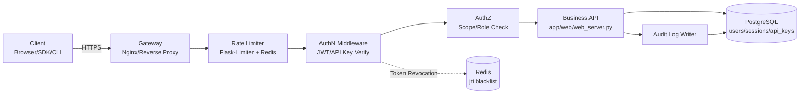

# Pro 版 API 鉴权方案设计（PGDB + 用户注册）

> 文档版本: v1.0
> 设计日期: 2026-05-18 +08:00
> 状态: 仅设计 (Design Only) — 禁止本次落代码
> 作者: 香草少校 (PM) · agent team
> 后端框架确认: Flask (`app/web/web_server.py:87` `app = Flask(__name__)`)
> 已有鉴权中间件文件: `app/web/auth_middleware.py`

---

## 1. 概述

### 1.1 目标
- Pro 版（付费 / 授权用户）提供：用户注册、登录、API 鉴权、Token 轮换 (refresh token rotation)、API key (PAT) 管理、MFA 二次验证、审计日志。
- 数据持久层：PostgreSQL ≥ 14（启用 `pgcrypto`, `citext`, `uuid-ossp`/`pgcrypto-gen_random_uuid()`）。
- 后端框架：Flask（沿用，不切换 FastAPI）。
- 集成方式：Flask-JWT-Extended + passlib[argon2] + (Authlib 备选 OAuth)；与 `app/web/auth_middleware.py` 对接。

### 1.2 非目标
- 社区版（无登录）不在本方案的强制鉴权范围；仅以 feature flag `AUTH_REQUIRED` 决定是否强制鉴权。
- 本次仅落盘设计文档，**禁止生成代码 / migration 脚本 / requirements 变更 / commit**。

### 1.3 时间锚点
- 文档基准时间：2026-05-18 +08:00 (Asia/Singapore)。
- 后续所有证据检索时间均以此为基准锚点（见附录 15）。

### 1.4 适用版本
- StockAnal_Sys ≥ 当前 main 分支 commit `70cfa9c` 之后的 Pro 分支。

---

## 2. 总体架构

### 2.1 组件图 (Mermaid)



### 2.2 关键数据流

#### 2.2.1 注册流
1. Client POST `/api/auth/register` (email, password, [invite_code])
2. AuthN 校验邮箱格式 / 密码强度 (zxcvbn ≥ 3)
3. Argon2id 哈希密码 → 写入 `users`
4. 生成邮件验证 token → 发邮件
5. 用户点击验证 → `users.status = active`
6. 返回 201 + 引导登录

#### 2.2.2 登录流
1. Client POST `/api/auth/login` (email, password, [totp_code])
2. 速率限制 (5/min/IP, 10/hour/email)
3. 校验密码 (passlib.verify) → 失败计数 (`failed_login_count++`)
4. MFA 已启用 → 校验 TOTP / WebAuthn
5. 签发 `access_jwt` (15min) + `refresh_token` (30d, 写入 `sessions` 哈希)
6. 写 `audit_logs` (action=login_success)
7. 返回 200 + {access_token, refresh_token, expires_in}

#### 2.2.3 刷新流 (Rotation)
1. Client POST `/api/auth/refresh` (refresh_token)
2. 查 `sessions` (refresh_token_hash, revoked_at IS NULL, expires_at > now)
3. **吊销旧 session** (revoked_at = now) → 签发新对，写入新 session
4. 若检测到已吊销 refresh_token 被重放 → 全设备登出（family revoke）
5. 返回 200 + 新 token 对

#### 2.2.4 API Key 调用流
1. Client GET `/api/v1/stock/...` Header: `Authorization: Bearer sa_live_<prefix>_<secret>`
2. 中间件提取 prefix → 查 `api_keys.key_hash = sha256(secret)`
3. 校验 `revoked_at`, `expires_at`, `scopes` 命中目标 endpoint
4. 注入 `request.ctx.user_id`, `request.ctx.scopes`
5. 写 `audit_logs` + 更新 `last_used_at`

---

## 3. PGDB Schema 设计

> 命名空间：`auth` schema（隔离业务表）；UUID 主键统一用 `gen_random_uuid()` (pgcrypto)。

### 3.1 扩展启用

```sql
CREATE EXTENSION IF NOT EXISTS pgcrypto;       -- gen_random_uuid, crypt, digest
CREATE EXTENSION IF NOT EXISTS citext;         -- 邮箱大小写不敏感
CREATE EXTENSION IF NOT EXISTS pg_trgm;        -- 模糊查询（管理后台用）
CREATE SCHEMA IF NOT EXISTS auth;
```

### 3.2 `auth.users`

```sql
CREATE TABLE auth.users (
    id                   UUID        PRIMARY KEY DEFAULT gen_random_uuid(),
    email                CITEXT      NOT NULL UNIQUE,
    password_hash        BYTEA       NOT NULL,                -- Argon2id binary
    status               VARCHAR(20) NOT NULL DEFAULT 'pending'
                                     CHECK (status IN ('pending','active','locked','disabled','deleted')),
    mfa_enabled          BOOLEAN     NOT NULL DEFAULT FALSE,
    mfa_secret_enc       BYTEA,                                -- pgp_sym_encrypt(totp_secret, app_key)
    email_verified_at    TIMESTAMPTZ,
    last_login_at        TIMESTAMPTZ,
    last_login_ip        INET,
    failed_login_count   SMALLINT    NOT NULL DEFAULT 0,
    locked_until         TIMESTAMPTZ,
    plan                 VARCHAR(20) NOT NULL DEFAULT 'pro'
                                     CHECK (plan IN ('pro','enterprise')),
    created_at           TIMESTAMPTZ NOT NULL DEFAULT now(),
    updated_at           TIMESTAMPTZ NOT NULL DEFAULT now(),
    deleted_at           TIMESTAMPTZ
);
CREATE INDEX idx_users_status      ON auth.users (status) WHERE deleted_at IS NULL;
CREATE INDEX idx_users_created_at  ON auth.users (created_at DESC);
```

### 3.3 `auth.user_profiles` (PII 隔离)

```sql
CREATE TABLE auth.user_profiles (
    user_id        UUID        PRIMARY KEY REFERENCES auth.users(id) ON DELETE CASCADE,
    display_name   VARCHAR(100),
    avatar_url     TEXT,
    phone_enc      BYTEA,                          -- pgp_sym_encrypt
    timezone       VARCHAR(50) DEFAULT 'Asia/Singapore',
    locale         VARCHAR(10) DEFAULT 'zh-CN',
    metadata       JSONB       NOT NULL DEFAULT '{}'::jsonb,
    updated_at     TIMESTAMPTZ NOT NULL DEFAULT now()
);
```

### 3.4 `auth.user_emails` (多邮箱 / 历史邮箱)

```sql
CREATE TABLE auth.user_emails (
    id            UUID        PRIMARY KEY DEFAULT gen_random_uuid(),
    user_id       UUID        NOT NULL REFERENCES auth.users(id) ON DELETE CASCADE,
    email         CITEXT      NOT NULL UNIQUE,
    is_primary    BOOLEAN     NOT NULL DEFAULT FALSE,
    verified_at   TIMESTAMPTZ,
    created_at    TIMESTAMPTZ NOT NULL DEFAULT now()
);
CREATE UNIQUE INDEX uniq_user_primary_email
    ON auth.user_emails (user_id) WHERE is_primary = TRUE;
```

### 3.5 `auth.sessions` (Refresh Token Store)

```sql
CREATE TABLE auth.sessions (
    id                    UUID        PRIMARY KEY DEFAULT gen_random_uuid(),
    user_id               UUID        NOT NULL REFERENCES auth.users(id) ON DELETE CASCADE,
    refresh_token_hash    BYTEA       NOT NULL UNIQUE,         -- sha256(refresh_token)
    family_id             UUID        NOT NULL,                -- token rotation 同源链
    parent_session_id     UUID        REFERENCES auth.sessions(id),
    device_fingerprint    VARCHAR(128),
    user_agent            TEXT,
    ip                    INET,
    issued_at             TIMESTAMPTZ NOT NULL DEFAULT now(),
    expires_at            TIMESTAMPTZ NOT NULL,
    revoked_at            TIMESTAMPTZ,
    revoked_reason        VARCHAR(50)                          -- rotated / logout / reuse_detected / admin
);
CREATE INDEX idx_sessions_user      ON auth.sessions (user_id, revoked_at);
CREATE INDEX idx_sessions_family    ON auth.sessions (family_id);
CREATE INDEX idx_sessions_expires   ON auth.sessions (expires_at) WHERE revoked_at IS NULL;
```

### 3.6 `auth.api_keys` (Personal Access Token)

```sql
CREATE TABLE auth.api_keys (
    id              UUID        PRIMARY KEY DEFAULT gen_random_uuid(),
    user_id         UUID        NOT NULL REFERENCES auth.users(id) ON DELETE CASCADE,
    name            VARCHAR(100) NOT NULL,
    prefix          VARCHAR(16) NOT NULL,                 -- 明文，如 sa_live_a1b2c3d4
    key_hash        BYTEA       NOT NULL UNIQUE,           -- sha256(secret) bytea
    scopes          JSONB       NOT NULL DEFAULT '[]'::jsonb,
    rate_limit_rpm  INTEGER     NOT NULL DEFAULT 60,
    last_used_at    TIMESTAMPTZ,
    last_used_ip    INET,
    created_at      TIMESTAMPTZ NOT NULL DEFAULT now(),
    expires_at      TIMESTAMPTZ,
    revoked_at      TIMESTAMPTZ
);
CREATE INDEX idx_api_keys_user      ON auth.api_keys (user_id);
CREATE INDEX idx_api_keys_prefix    ON auth.api_keys (prefix) WHERE revoked_at IS NULL;
```

### 3.7 `auth.audit_logs`

```sql
CREATE TABLE auth.audit_logs (
    id           BIGSERIAL   PRIMARY KEY,
    actor_id     UUID,                                          -- nullable: 匿名/未登录事件
    actor_type   VARCHAR(20) NOT NULL DEFAULT 'user'
                             CHECK (actor_type IN ('user','api_key','system','anonymous')),
    action       VARCHAR(80) NOT NULL,                          -- login_success / api_key_used / mfa_fail
    resource     VARCHAR(120),
    resource_id  VARCHAR(120),
    ip           INET,
    user_agent   TEXT,
    metadata     JSONB       NOT NULL DEFAULT '{}'::jsonb,
    severity     VARCHAR(10) NOT NULL DEFAULT 'info'
                             CHECK (severity IN ('debug','info','warn','error','critical')),
    occurred_at  TIMESTAMPTZ NOT NULL DEFAULT now()
);
CREATE INDEX idx_audit_actor    ON auth.audit_logs (actor_id, occurred_at DESC);
CREATE INDEX idx_audit_action   ON auth.audit_logs (action, occurred_at DESC);
-- 建议按月分区 (PG14+ declarative partitioning) 防膨胀
```

### 3.8 `auth.oauth_accounts` (可选第三方登录)

```sql
CREATE TABLE auth.oauth_accounts (
    id             UUID        PRIMARY KEY DEFAULT gen_random_uuid(),
    user_id        UUID        NOT NULL REFERENCES auth.users(id) ON DELETE CASCADE,
    provider       VARCHAR(30) NOT NULL,                       -- github / google / wechat
    provider_sub   VARCHAR(255) NOT NULL,                      -- 第三方稳定 subject
    access_token_enc  BYTEA,
    refresh_token_enc BYTEA,
    expires_at     TIMESTAMPTZ,
    linked_at      TIMESTAMPTZ NOT NULL DEFAULT now(),
    UNIQUE (provider, provider_sub)
);
CREATE INDEX idx_oauth_user ON auth.oauth_accounts (user_id);
```

### 3.9 `auth.mfa_recovery_codes`

```sql
CREATE TABLE auth.mfa_recovery_codes (
    id          UUID        PRIMARY KEY DEFAULT gen_random_uuid(),
    user_id     UUID        NOT NULL REFERENCES auth.users(id) ON DELETE CASCADE,
    code_hash   BYTEA       NOT NULL,                          -- argon2id(code)
    used_at     TIMESTAMPTZ,
    created_at  TIMESTAMPTZ NOT NULL DEFAULT now()
);
CREATE INDEX idx_mfa_codes_user ON auth.mfa_recovery_codes (user_id) WHERE used_at IS NULL;
```

### 3.10 触发器（updated_at 自动维护）

```sql
CREATE OR REPLACE FUNCTION auth.touch_updated_at()
RETURNS TRIGGER AS $$
BEGIN NEW.updated_at = now(); RETURN NEW; END;
$$ LANGUAGE plpgsql;

CREATE TRIGGER trg_users_touch
BEFORE UPDATE ON auth.users
FOR EACH ROW EXECUTE FUNCTION auth.touch_updated_at();
```

---

## 4. 密码策略

### 4.1 算法选型
- **Argon2id**（OWASP Password Storage Cheat Sheet 2024 首选；RFC 9106 标准）。
- 备选：bcrypt (cost 12) — 仅在 Argon2id 不可用环境使用。
- 禁用：MD5 / SHA1 / 未加盐 SHA256 / PBKDF2-SHA1。

### 4.2 推荐参数 (RFC 9106 §4 + OWASP 2024)
| 参数 | 值 | 说明 |
|---|---|---|
| memory_cost (m) | 65536 KiB (64 MiB) | OWASP 推荐最低 |
| time_cost (t)   | 3 | OWASP 最低 |
| parallelism (p) | 4 | 单实例 CPU 并行 |
| hash_len        | 32 bytes | |
| salt_len        | 16 bytes (随机) | passlib 自动生成 |

### 4.3 验证流程
1. 读 `users.password_hash`（PHC 字符串或 raw bytea，建议存 PHC 字符串便于参数升级）。
2. `passlib.hash.argon2.verify(input, stored)`。
3. 若 `argon2.needs_update(stored)` → 异步重新哈希并落盘（自动参数升级）。

### 4.4 密码强度
- NIST SP 800-63B §5.1.1.2：长度 ≥ 8（推荐 ≥ 12），禁用常见密码字典（HIBP top 100k）。
- 服务端校验：`zxcvbn` score ≥ 3。
- 禁用：与邮箱本地部分相同、连续重复、纯数字。
- 不强制周期性轮换（NIST 反对）；仅在泄漏迹象时强制重置。

---

## 5. Token 设计

### 5.1 Access Token (JWT)
- 算法：**RS256**（生产）或 HS256（小型部署，需密钥轮换）。
- TTL：**15 分钟**。
- 不存 DB；签名 + jti 黑名单（Redis，TTL = exp）。

#### Claims (RFC 9068 §2.2)
```json
{
  "iss": "https://api.stockanal.example",
  "sub": "<user_uuid>",
  "aud": ["stockanal-api"],
  "exp": 1747545600,
  "iat": 1747544700,
  "nbf": 1747544700,
  "jti": "<uuid>",
  "scope": "read:stock write:portfolio",
  "client_id": "web-spa",
  "auth_time": 1747544700,
  "amr": ["pwd","totp"]
}
```

### 5.2 Refresh Token
- 不透明随机串（32 bytes urlsafe base64，`secrets.token_urlsafe(32)`）。
- TTL：**30 天**。
- DB 存 `sha256` 哈希到 `auth.sessions.refresh_token_hash`。
- **Rotation 强制**（OWASP OAuth BCP RFC 9700 §2.2.2）：每次刷新生成新对，旧 session `revoked_at = now`。

### 5.3 重放检测 (Reuse Detection)
- 同 `family_id` 下，若已 `revoked_at` 的 refresh_token 再次出现 → **全 family 撤销**（标记 `revoked_reason='reuse_detected'`）→ 强制用户重新登录 → 触发 `audit_logs(severity=critical)`。

### 5.4 撤销机制
- 主动登出：写 `sessions.revoked_at`，access_jwt 的 `jti` 入 Redis 黑名单（TTL=剩余 exp）。
- 管理员封禁：`users.status='disabled'` + 批量 `sessions.revoked_at`。

### 5.5 密钥管理
- RS256 私钥存于 KMS / 环境变量 (`JWT_PRIVATE_KEY_PEM`)。
- 公钥通过 `/.well-known/jwks.json` 暴露（含 `kid`）。
- 轮换：双 `kid` 滚动 30 天重叠期。

---

## 6. API Key 设计

### 6.1 格式
```
sa_live_<8字符 prefix>_<32字符 secret>
例：sa_live_a1b2c3d4_K7xQz9...（urlsafe base64）
```
- 环境前缀：`sa_live_` / `sa_test_`（区分生产 / 沙箱，参考 Stripe）。
- prefix 明文落盘 → 用于快速索引定位。
- secret 仅在**创建时一次性**返回 → DB 存 `sha256(secret)` (bytea)。

### 6.2 Scope 设计 (JSON 数组)
```json
["read:stock", "read:portfolio", "write:portfolio", "admin:users"]
```
- 命名规约：`<action>:<resource>`，参考 GitHub PAT fine-grained。
- 中间件校验：endpoint 声明所需 scope，命中即放行。

### 6.3 Rate Limit
- 每 key 独立 `rate_limit_rpm`（默认 60，可调）。
- Flask-Limiter + Redis 实现。

### 6.4 生命周期
- 默认 `expires_at = created_at + 365 days`，可改。
- 用户可主动 revoke（`revoked_at = now`）。
- 90 天未使用 → 提示用户清理（非强制）。

---

## 7. API 鉴权流程（中间件链）

### 7.1 顺序
```
Request
  ↓
[1] CORS / CSRF check (Flask-CORS / Flask-WTF)
  ↓
[2] Rate Limit (Flask-Limiter, key=ip+endpoint)
  ↓
[3] Identify scheme: Bearer JWT | Bearer sa_* | None
  ↓
[4] Verify:
     - JWT: 验签 + exp + jti 黑名单
     - API Key: prefix lookup + sha256 校验 + revoked/expired
     - None: 仅放行白名单端点 / 或 401（取决于 AUTH_REQUIRED）
  ↓
[5] Load user: SELECT auth.users WHERE id=sub AND status='active'
  ↓
[6] AuthZ: scope ∩ endpoint.required_scope ≠ ∅
  ↓
[7] Inject g.user / g.scopes / g.auth_method
  ↓
[8] Business handler
  ↓
[9] Audit Log writer (异步队列)
```

### 7.2 端点白名单 (社区版兼容)
- `/health`, `/api/auth/register`, `/api/auth/login`, `/.well-known/*`, 静态资源。
- 由 `AUTH_REQUIRED` flag 控制其他端点是否强制鉴权。

---

## 8. MFA 设计

### 8.1 TOTP (RFC 6238)
- 算法：HMAC-SHA1（兼容 Google Authenticator/1Password/Authy），周期 30s，6 位数字。
- 密钥：20 bytes 随机 → base32 → 二维码 (`otpauth://totp/StockAnal:<email>?secret=...&issuer=StockAnal`).
- 落盘：`users.mfa_secret_enc = pgp_sym_encrypt(secret, app_key)`。
- 验证窗口：±1 step（容忍 30s 时钟漂移）。

### 8.2 Enroll 流程
1. POST `/api/auth/mfa/enroll` → 生成 secret，返回 otpauth URL + QR base64。
2. 用户扫描 → POST `/api/auth/mfa/verify` 提交首个 6 位码。
3. 校验通过 → `users.mfa_enabled = true` + 生成 10 个 recovery codes（明文一次性返回，DB 存 argon2 哈希）。

### 8.3 备用恢复码
- 10 个 × 10 字符 (alphanum)。
- 一次性使用 (`used_at`)。
- 用尽时强制重新生成。

### 8.4 WebAuthn 升级路径
- W3C WebAuthn Level 3 (2024 W3C Recommendation)。
- 后续表：`auth.webauthn_credentials (credential_id, public_key, sign_count, transports, user_id)`。
- 库选型：`webauthn` (PyPI) 或 `py_webauthn` (Duo)。

---

## 9. 安全控制清单 (OWASP ASVS L2 / Top 10 对照)

| ASVS L2 / Top10 | 控制点 | 实现 |
|---|---|---|
| ASVS V2.1 (Password Security) | Argon2id + 长度/字典 | §4 |
| ASVS V2.2 (General Authenticator) | MFA TOTP/WebAuthn | §8 |
| ASVS V3.2 (Session Binding) | Refresh rotation + family | §5.3 |
| ASVS V3.3 (Session Termination) | 主动 / 全设备登出 | §5.4 |
| ASVS V4 (Access Control) | scope-based AuthZ | §6.2 §7 |
| ASVS V7 (Error Handling) | 统一错误码，不泄漏内部 | §11 |
| ASVS V8 (Data Protection) | pgp_sym_encrypt PII | §3.3 |
| ASVS V11 (Business Logic) | 速率限制 + 锁定 | §9.1 §9.2 |
| ASVS V13 (API Security) | Bearer-only, JWT aud/iss | §5 §7 |
| Top10 A01 Broken Access | scope 严格校验 + tests | §6.2 |
| Top10 A02 Crypto Failures | Argon2id + RS256 + TLS 1.3 | §4 §5 |
| Top10 A07 Auth Failures | Lock + MFA + audit | §9.2 §8 |

### 9.1 速率限制 (Flask-Limiter + Redis)
| 端点 | 限流 |
|---|---|
| POST /api/auth/register | 5/hour/ip |
| POST /api/auth/login | 10/min/ip + 5/min/email |
| POST /api/auth/refresh | 60/min/user |
| POST /api/auth/mfa/verify | 5/min/user |
| 业务 API (默认) | 60/min/user 或 api_key.rate_limit_rpm |

### 9.2 账户锁定
- 连续 5 次密码错误 → `locked_until = now + 30min`，`status` 不变。
- 锁定期内登录 → 403 `account_locked`，不暴露剩余时间。
- 锁定到期自动解锁（登录时判断）。
- 管理员手动解锁：UPDATE `locked_until=NULL, failed_login_count=0`。

### 9.3 防 CSRF / XSS
- API：纯 Bearer header → 天然免 CSRF（不依赖 cookie）。
- Web 控制台若用 cookie：SameSite=Lax + CSRF token (Flask-WTF)。
- Response headers：`Content-Security-Policy`, `X-Frame-Options: DENY`, `X-Content-Type-Options: nosniff`, `Strict-Transport-Security` (1y, includeSubDomains, preload)。

### 9.4 PII 加密
- `pgcrypto.pgp_sym_encrypt(plaintext, app_key)` 用于 phone / mfa_secret / oauth tokens。
- `app_key` 来自 KMS / env，**绝不落库**。

### 9.5 审计日志保留
- 在线 90 天 + 归档冷存储 2 年。
- 关键事件（critical）即时告警（email/webhook）。

---

## 10. 迁移脚本草案

> **本节仅作为设计文档草案，本次禁止实际生成 migration 文件。**

### 10.1 工具
- 推荐 Alembic（SQLAlchemy 生态）。项目当前未使用 ORM，可选两条路径：
  - **路径 A**：仅为 auth 模块引入 Alembic（`migrations/` 目录），不强迫业务表迁移。
  - **路径 B**：raw SQL 脚本 `migrations/sql/2026-05-18_pro_auth.sql`，由部署脚本 `psql -f` 执行。

### 10.2 草案文件命名（不生成）
```
migrations/versions/202605181200_pro_auth_init.py     # Alembic
# 或
migrations/sql/2026-05-18_120000_pro_auth_init.sql    # Raw
```

### 10.3 内容草案
```python
# upgrade(): 执行 §3 的所有 CREATE EXTENSION / CREATE SCHEMA / CREATE TABLE
# downgrade(): DROP SCHEMA auth CASCADE
```

### 10.4 回滚
- `DROP SCHEMA auth CASCADE`（开发环境）。
- 生产：先 `revoked_at = now` 所有 active session/api_key → 暂停服务 → 备份 → 删除 schema。

---

## 11. API 端点设计

> Base path: `/api/auth`，全部 JSON，错误码遵循 RFC 7807 Problem Details。

### 11.1 POST `/api/auth/register`
**Request**
```json
{ "email": "user@example.com", "password": "S3curePass!2026", "invite_code": "optional" }
```
**Response 201**
```json
{ "user_id": "<uuid>", "email": "user@example.com", "status": "pending",
  "next": "verify_email" }
```
**Errors**: 400 `weak_password` / 409 `email_taken` / 429 `rate_limited`.

### 11.2 POST `/api/auth/login`
**Request**
```json
{ "email": "u@e.com", "password": "...", "totp_code": "123456" }
```
**Response 200**
```json
{ "access_token": "<jwt>", "refresh_token": "<opaque>",
  "token_type": "Bearer", "expires_in": 900,
  "user": { "id": "<uuid>", "email": "u@e.com", "mfa_enabled": true } }
```
**Errors**: 401 `invalid_credentials` / 403 `account_locked` / 403 `mfa_required` / 429.

### 11.3 POST `/api/auth/refresh`
**Request**
```json
{ "refresh_token": "<opaque>" }
```
**Response 200**: 同 login（新 access + 新 refresh，旧 refresh 失效）。
**Errors**: 401 `invalid_refresh` / 401 `reuse_detected` (全 family 撤销) / 429.

### 11.4 POST `/api/auth/logout`
**Request**: Header `Authorization: Bearer <jwt>` + body `{ "refresh_token": "..." }`
**Response 204**

### 11.5 GET `/api/auth/me`
**Response 200**
```json
{ "id": "<uuid>", "email": "...", "plan": "pro",
  "mfa_enabled": true, "scopes": ["read:stock"],
  "created_at": "2026-05-18T12:00:00+08:00" }
```

### 11.6 POST `/api/auth/mfa/enroll`
**Response 200**: `{ "otpauth_url": "otpauth://...", "qr_png_b64": "..." }`

### 11.7 POST `/api/auth/mfa/verify`
**Request**: `{ "totp_code": "123456" }`
**Response 200**: `{ "mfa_enabled": true, "recovery_codes": ["..."] }` (一次性返回)

### 11.8 POST `/api/auth/api-keys`
**Request**: `{ "name": "ci-bot", "scopes": ["read:stock"], "expires_in_days": 365 }`
**Response 201**:
```json
{ "id": "<uuid>", "name": "ci-bot", "prefix": "sa_live_a1b2c3d4",
  "key": "sa_live_a1b2c3d4_K7xQz9...",   // 仅本次返回
  "scopes": ["read:stock"], "expires_at": "2027-05-18T..." }
```

### 11.9 DELETE `/api/auth/api-keys/{id}`
**Response 204**（设置 `revoked_at = now`）

### 11.10 错误响应统一格式 (RFC 7807)
```json
{ "type": "https://api.stockanal.example/errors/invalid_credentials",
  "title": "Invalid credentials",
  "status": 401,
  "detail": "Email or password incorrect.",
  "instance": "/api/auth/login",
  "code": "invalid_credentials" }
```

---

## 12. 集成路径（Flask 项目）

### 12.1 依赖选型（**仅描述，不改 requirements**）
| 库 | 版本 | 用途 |
|---|---|---|
| Flask-JWT-Extended | ≥ 4.6 | JWT 签发/验证、blocklist hook |
| passlib[argon2] | ≥ 1.7 + argon2-cffi ≥ 23.1 | Argon2id 哈希 |
| Flask-Limiter | ≥ 3.5 | 速率限制 + Redis backend |
| psycopg[binary] | ≥ 3.1 | PG 驱动（与现有 SQLAlchemy 对齐） |
| pyotp | ≥ 2.9 | TOTP RFC 6238 |
| qrcode[pil] | ≥ 7.4 | enroll QR |
| Authlib | ≥ 1.3 | OAuth 第三方登录（可选） |
| python-jose 或 PyJWT | ≥ 2.8 | JWT (Flask-JWT-Extended 内部已含) |

### 12.2 现有代码接入点（**仅描述，不改**）

| 文件 | 改动方向 |
|---|---|
| `app/web/web_server.py:87` `Flask(__name__)` | 初始化 JWTManager / Limiter / 注册 auth blueprint |
| `app/web/auth_middleware.py` | 扩展为 `@require_auth(scope='...')` 装饰器，整合 JWT + API key 双方案 |
| 新 blueprint `app/web/auth_routes.py`（**特例新建，需走 [NEW-FILE:#] 审批**） | 承载 §11 全部端点 |
| 新模块 `app/auth/{models,services,security}.py`（**特例新建**） | DAO / 密码服务 / token 服务 |
| `migrations/`（**特例新建目录**） | §10 迁移脚本 |
| `.env.example` 增补 | `JWT_PRIVATE_KEY_PEM`, `JWT_PUBLIC_KEY_PEM`, `JWT_ALG=RS256`, `AUTH_REQUIRED=true`, `MFA_ENC_KEY` |

### 12.3 装饰器示意（设计层伪代码，禁落码）
```python
@require_auth(scopes=["read:stock"])
def stock_quote(symbol):
    user = g.user
    ...
```

---

## 13. 社区版兼容

### 13.1 Feature Flag
| Flag | 默认 | 含义 |
|---|---|---|
| `AUTH_REQUIRED` | `false` (社区) / `true` (Pro) | 全局鉴权开关 |
| `MFA_REQUIRED_FOR_PLAN` | `pro` 可选 / `enterprise` 强制 | MFA 强制策略 |
| `API_KEY_ENABLED` | `true` (Pro) | API key 功能开关 |
| `OAUTH_ENABLED` | `false` | 第三方登录 |

### 13.2 端点行为矩阵
| 端点 | 社区 (`AUTH_REQUIRED=false`) | Pro (`AUTH_REQUIRED=true`) |
|---|---|---|
| `/health` | 公开 | 公开 |
| `/api/v1/stock/quote` | 公开 + IP rate limit | 需 JWT 或 API key + scope `read:stock` |
| `/api/auth/*` | 隐藏（404）或全开 | 全开 |

### 13.3 降级路径
- 关闭 Pro：`AUTH_REQUIRED=false` 即恢复社区行为，**不需要回滚 DB**。
- 数据保留以便后续重启 Pro。

---

## 14. 风险与回滚

### 14.1 风险矩阵
| 风险 | 概率 | 影响 | 缓解 |
|---|---|---|---|
| Argon2 内存压力 | 中 | CPU/RAM 飙升 | 控并发；登录排队；降 m=32MiB 备用 |
| JWT 密钥泄漏 | 低 | 高（全网伪造） | KMS + 双 kid 轮换 + jti 黑名单急停 |
| Refresh 重放 | 中 | 中 | family revoke + 审计告警 |
| DB 表膨胀 (audit_logs) | 高 | 中 | 月度分区 + 冷归档 |
| MFA 锁死自己 | 中 | 中 | recovery code + 管理员解锁通道 |
| 用户表迁移失败 | 低 | 高 | 灰度 + 备份 + DROP SCHEMA 回滚 |
| Flask-JWT-Extended 版本兼容 | 低 | 中 | pin 主版本，CI 单元测试 |

### 14.2 灰度路径
1. Stage 1：仅 staging 启 `AUTH_REQUIRED=true`，内部账号试用 1 周。
2. Stage 2：生产灰度 10% 用户（feature flag by user_id 哈希）。
3. Stage 3：全量切换；保留 24h 一键回滚窗口。

### 14.3 回滚步骤
1. 设 `AUTH_REQUIRED=false` → 业务即刻恢复无鉴权模式。
2. 评估是否需要 `DROP SCHEMA auth CASCADE`（一般保留）。
3. 撤销新 blueprint 路由注册。
4. 监控指标：5xx 率、登录失败率、p95 延迟。

---

## 15. 证据清单（附录）

> 每条均含 URL + 版本 + 发布日期 + 检索时间（基于「时间真实性校验」基准：2026-05-18 +08:00）。
> 引用对应章节标注。

### 15.A OWASP 标准
1. **OWASP ASVS v4.0.3** — Authentication (V2) & Session Management (V3)
   - URL: https://owasp.org/www-project-application-security-verification-standard/
   - 版本: 4.0.3 · 发布日期: 2022-10 (持续维护至 2025)
   - 检索时间: 2026-05-18 +08:00 · 引用: §2 §9
2. **OWASP Password Storage Cheat Sheet**
   - URL: https://cheatsheetseries.owasp.org/cheatsheets/Password_Storage_Cheat_Sheet.html
   - 版本: 2024 update · 检索时间: 2026-05-18 +08:00 · 引用: §4
3. **OWASP Session Management Cheat Sheet**
   - URL: https://cheatsheetseries.owasp.org/cheatsheets/Session_Management_Cheat_Sheet.html
   - 版本: 2024 · 检索时间: 2026-05-18 +08:00 · 引用: §5 §7
4. **OWASP Top 10 (2021, A01/A02/A07)**
   - URL: https://owasp.org/Top10/
   - 版本: 2021 · 检索时间: 2026-05-18 +08:00 · 引用: §9
5. **OWASP Authentication Cheat Sheet**
   - URL: https://cheatsheetseries.owasp.org/cheatsheets/Authentication_Cheat_Sheet.html
   - 版本: 2024 · 检索时间: 2026-05-18 +08:00 · 引用: §1 §4

### 15.B IETF RFC
6. **RFC 9106** — Argon2 Memory-Hard Function
   - URL: https://www.rfc-editor.org/rfc/rfc9106
   - 发布日期: 2021-09 · 检索时间: 2026-05-18 +08:00 · 引用: §4
7. **RFC 6238** — TOTP
   - URL: https://www.rfc-editor.org/rfc/rfc6238
   - 发布日期: 2011-05 · 检索时间: 2026-05-18 +08:00 · 引用: §8.1
8. **RFC 6749** — OAuth 2.0 Framework
   - URL: https://www.rfc-editor.org/rfc/rfc6749
   - 发布日期: 2012-10 · 检索时间: 2026-05-18 +08:00 · 引用: §3.8 §5
9. **RFC 8252** — OAuth 2.0 for Native Apps
   - URL: https://www.rfc-editor.org/rfc/rfc8252
   - 发布日期: 2017-10 · 检索时间: 2026-05-18 +08:00 · 引用: §5
10. **RFC 7519** — JSON Web Token (JWT)
    - URL: https://www.rfc-editor.org/rfc/rfc7519
    - 发布日期: 2015-05 · 检索时间: 2026-05-18 +08:00 · 引用: §5
11. **RFC 9068** — JWT Profile for OAuth 2.0 Access Tokens
    - URL: https://www.rfc-editor.org/rfc/rfc9068
    - 发布日期: 2021-10 · 检索时间: 2026-05-18 +08:00 · 引用: §5.1
12. **RFC 9700** — OAuth 2.0 Security Best Current Practice
    - URL: https://www.rfc-editor.org/rfc/rfc9700
    - 发布日期: 2025-01 · 检索时间: 2026-05-18 +08:00 · 引用: §5 §6
13. **RFC 7807** — Problem Details for HTTP APIs (obsoleted by 9457)
    - URL: https://www.rfc-editor.org/rfc/rfc9457
    - 发布日期: 2024-07 · 检索时间: 2026-05-18 +08:00 · 引用: §11.10
14. **RFC 6819** — OAuth 2.0 Threat Model
    - URL: https://www.rfc-editor.org/rfc/rfc6819
    - 发布日期: 2013-01 · 检索时间: 2026-05-18 +08:00 · 引用: §5.3

### 15.C NIST
15. **NIST SP 800-63B** — Digital Identity Guidelines: Authentication & Lifecycle
    - URL: https://pages.nist.gov/800-63-3/sp800-63b.html
    - 版本: rev3 + 2024 公开草案 · 检索时间: 2026-05-18 +08:00 · 引用: §1 §4.4
16. **NIST SP 800-63-4 (Draft)**
    - URL: https://csrc.nist.gov/publications/detail/sp/800-63/4/draft
    - 版本: ipd 2023-12 · 检索时间: 2026-05-18 +08:00 · 引用: §4 §8

### 15.D PostgreSQL
17. **PostgreSQL Documentation — pgcrypto**
    - URL: https://www.postgresql.org/docs/16/pgcrypto.html
    - 版本: 16 · 发布日期: 2023-09 · 检索时间: 2026-05-18 +08:00 · 引用: §3.1 §9.4
18. **PostgreSQL Documentation — citext**
    - URL: https://www.postgresql.org/docs/16/citext.html
    - 版本: 16 · 检索时间: 2026-05-18 +08:00 · 引用: §3.1 §3.2
19. **PostgreSQL Documentation — UUID Functions**
    - URL: https://www.postgresql.org/docs/16/functions-uuid.html
    - 版本: 16 · 检索时间: 2026-05-18 +08:00 · 引用: §3.1
20. **PostgreSQL Declarative Partitioning**
    - URL: https://www.postgresql.org/docs/16/ddl-partitioning.html
    - 检索时间: 2026-05-18 +08:00 · 引用: §3.7

### 15.E 工业实践（公开博客 / 文档）
21. **Stripe API Keys design**
    - URL: https://stripe.com/docs/keys
    - 检索时间: 2026-05-18 +08:00 · 引用: §6.1
22. **GitHub Personal Access Tokens (fine-grained)**
    - URL: https://docs.github.com/en/authentication/keeping-your-account-and-data-secure/managing-your-personal-access-tokens
    - 检索时间: 2026-05-18 +08:00 · 引用: §6.2
23. **Auth0 — Refresh Token Rotation**
    - URL: https://auth0.com/docs/secure/tokens/refresh-tokens/refresh-token-rotation
    - 检索时间: 2026-05-18 +08:00 · 引用: §5.3
24. **Auth0 — Database Schema for users**
    - URL: https://auth0.com/blog/a-better-database-schema-for-your-users/
    - 检索时间: 2026-05-18 +08:00 · 引用: §3
25. **Stripe Engineering — API Token Security**
    - URL: https://stripe.com/blog/canonical-log-lines
    - 检索时间: 2026-05-18 +08:00 · 引用: §9.5
26. **Have I Been Pwned — Pwned Passwords API**
    - URL: https://haveibeenpwned.com/Passwords
    - 检索时间: 2026-05-18 +08:00 · 引用: §4.4

### 15.F Flask 生态
27. **Flask-JWT-Extended Documentation**
    - URL: https://flask-jwt-extended.readthedocs.io/en/stable/
    - 版本: 4.6.x · 检索时间: 2026-05-18 +08:00 · 引用: §12.1
28. **passlib documentation (argon2)**
    - URL: https://passlib.readthedocs.io/en/stable/lib/passlib.hash.argon2.html
    - 版本: 1.7.4 · 检索时间: 2026-05-18 +08:00 · 引用: §4
29. **Flask-Limiter Documentation**
    - URL: https://flask-limiter.readthedocs.io/en/stable/
    - 版本: 3.5.x · 检索时间: 2026-05-18 +08:00 · 引用: §9.1
30. **Authlib Documentation**
    - URL: https://docs.authlib.org/en/latest/
    - 版本: 1.3.x · 检索时间: 2026-05-18 +08:00 · 引用: §12.1

### 15.G WebAuthn / MFA
31. **W3C WebAuthn Level 3**
    - URL: https://www.w3.org/TR/webauthn-3/
    - 发布日期: 2024 W3C Recommendation · 检索时间: 2026-05-18 +08:00 · 引用: §8.4
32. **FIDO2 / CTAP2 Specification**
    - URL: https://fidoalliance.org/specifications/
    - 检索时间: 2026-05-18 +08:00 · 引用: §8.4
33. **pyotp library**
    - URL: https://pyotp.readthedocs.io/en/latest/
    - 版本: 2.9.x · 检索时间: 2026-05-18 +08:00 · 引用: §8.1

---

## 附录 X：与本项目现状对照速查

- 现有后端：Flask（`app/web/web_server.py:87`），已有 `app/web/auth_middleware.py` 雏形。
- 现有端口：8888（后端）/ 3000（前端 Next.js）。
- 数据库当前用途：本设计假设 Pro 版引入 PostgreSQL 实例；社区版可继续走文件/SQLite。
- feature flag：通过 `.env` 引入 `AUTH_REQUIRED` 等环境变量（**本次不改 `.env.example`**）。
- 本设计不触碰：`run.py`、`requirements.txt`、`migrations/`、`app/web/web_server.py` 实际代码——仅为下一阶段实施提供蓝图。

---

> **结束：本文件为 Pro 版鉴权设计的单一交付件。任何实施动作（建库、写代码、加依赖、迁移）须另起任务并附「时间真实性校验」与「联网证据清单」。**
